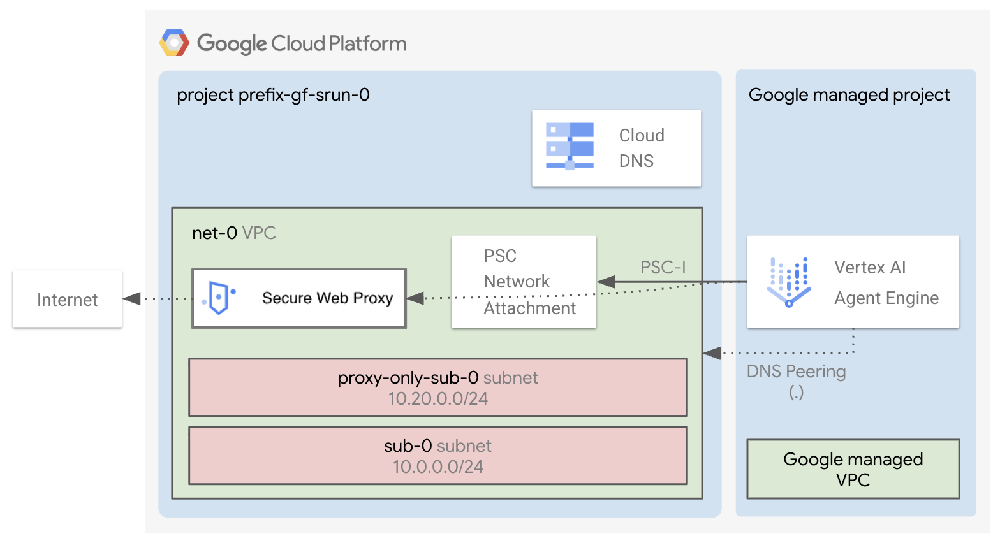

# Agent Engine Factory

The factory deploys a [Vertex AI Agent Engine (aka Reasoning Engine)](https://docs.cloud.google.com/agent-builder/agent-engine/overview).

## Applications

After the [1-apps](1-apps/README.md) deployment finishes, the Terraform output will print the commands to interact with the agent.

## Core Components

The deployment includes:

- The **agent**, that privately access resources in your VPC.
- A custom **service account** used by your agent.
- Optionally, a VPC, the subnets you need and Secure Web Proxy (SWP), so that your agent can access the Internet through your VPC and via a proxy.

## Source code deployment

By default, the factory deploys your code by using *Agent Engine source based deployments*.
This means the agent expects a *tar.gz package*, containing your agent definition and your *requirements.txt* file.
This is the most recent way of deploying code in Agent Engine and we believe this is what most of users need to use.

In case of need, the underlying Agent Engine module also supports the *serialized object deployment*.
You can easily adapt this factory to work with it. You can find instructions directly on the [Cloud Foundation Fabric website](https://github.com/GoogleCloudPlatform/cloud-foundation-fabric/tree/master/modules/agent-engine#serialized-object-deployment).

## Protect access to the agent by using VPC-SC

You can protect your agent with *VPC-SC* by restricting access to the `aiplatform.googleapis.com` API.
Setting up VPC-SC is a foundational building block and it's outside the scope of this factory.

## Apply the factory

- Enter the [0-projects](0-projects/README.md) folder and follow the instructions to setup your GCP project, service accounts and permissions
- Go to the [1-apps](1-apps/README.md) folder and follow the instructions to deploy the agent
