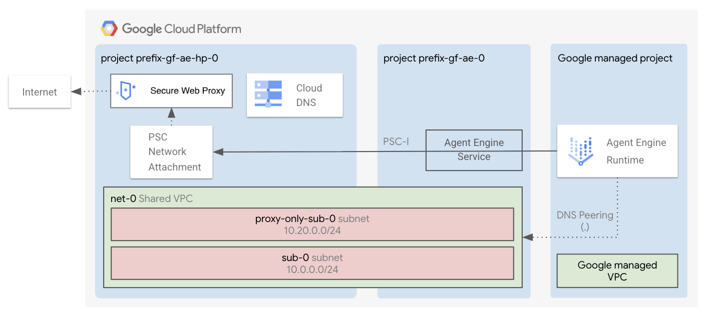

# Agent Runtime Factory

The factory deploys a [Gemini Enterprise Agent Platform (GEAP) Agent Runtime](https://docs.cloud.google.com/agent-builder/agent-engine/overview), formerly known as Vertex AI Agent Engine (or Reasoning Engine).

## Applications

After the [1-apps](1-apps/README.md) deployment finishes, the Terraform output will print the commands to interact with the agent.

## Core Components

The deployment includes:

- The **agent**, that privately access resources in your VPC.
- A custom **service account** used by your agent.
- **Firestore** to store ADK sessions and A2A tasks.

- By default, a **host project**, a **shared VPC**, a subnet, private Google APIs routes, DNS policies, a PSC Network Attachment, Secure Web Proxy (SWP) and Cloud NAT so that the agent can privately access your resources and the Internet (through the proxy). Optionally, you can use your own host project and shared VPCs.

- A **service project** with all the necessary APIs, service accounts, permissions set.

## Govern the agent traffic with Agent Gateway

An Agent Runtime can send its traffic through an [Agent Gateway](https://docs.cloud.google.com/gemini-enterprise-agent-platform/govern/gateways/agent-gateway-overview), which resolves destinations against Agent Registry and authorizes every call. Deploy the gateways with the [ge-agent-platform](../ge-agent-platform/README.md) factory, then pass their ids to `var.agent_gateway_ids` in [1-apps](1-apps/README.md).

## Source code deployment

By default, the factory deploys your code by using *Agent Runtime source based deployments*.
This means the agent expects a *tar.gz package*, containing your agent definition and your *requirements.txt* file.
This is the most recent way of deploying code in Agent Runtime and we believe this is what most of users need to use.

In case of need, the underlying Agent Runtime module also supports other ways of deploying the code.
You can find instructions directly on the [Cloud Foundation Fabric website](https://github.com/GoogleCloudPlatform/cloud-foundation-fabric/tree/master/modules/geap-agent-runtime#serialized-object-deployment).

## Firestore as a memory store

We use [Firestore](https://firebase.google.com/docs/firestore) as the default store for ADK sessions and A2A tasks.
We need this to avoid eventual consistency issues when the containers scale out.
Also, this is the tool that users most commonly use in production.
You can swap it with your own database. In this case, you'll need to remove the Firestore instantiation from Terraform and update the applications code.

## Protect access to the agent by using VPC-SC

You can protect your agent with *VPC-SC* by restricting access to the `aiplatform.googleapis.com` API.
Setting up VPC-SC is a foundational building block and it's outside the scope of this factory.

## Apply the factory

- Enter the [0-prereqs](0-prereqs/README.md) folder and follow the instructions to setup your GCP project, service accounts and permissions
- Go to the [1-apps](1-apps/README.md) folder and follow the instructions to deploy the agent
