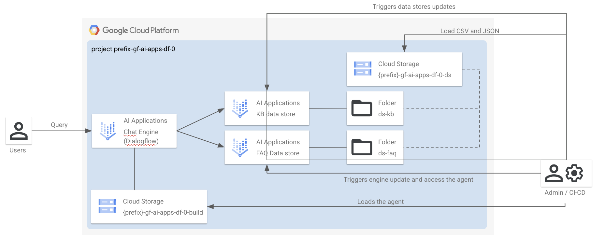

# AI Applications - Conversational Agents (Dialogflow) / Platform Deployment

This module is part of the `AI Applications - Conversational Agents (Dialogflow)`.
It is responsible for deploying the components enabling the AI use case, either in the project you created in [0-projects](../0-projects) or in an existing project.



## Deploy the module

This assumes you have created a project leveraging the [0-projects](../0-projects) module.

```shell
cp terraform.tfvars.sample terraform.tfvars # Customize
terraform init
terraform apply

# Follow the commands in the output.
```

## I have not used 0-projects

The [0-projects](../0-projects) module also produces the Terraform input files needed for this stage to work. If you are not leveraging [0-projects](../0-projects) it's your responsibility to create the `terraform.tfvars` file, reflecting what's requested by [variables.tf](./variables.tf) in this module.

## Concepts

- A copy of your agent is stored in the `agents/` folder.
- A build step will automatically update resource references (e.g. Data Store names) within the agent definitions before pushing, to keep consistency with the ones that are deployed via Terraform
- You can define arbitrary agent variants, as long as they are compatible with the Terraform definition. Each variant is stored in a `agents/<agent_variant>` folder.
- You can pull changes from an external agent into each of the variants

## Pull changes from a remote agent

If you are maintaining a separate development copy of your agent and want to pull its content to your local versioned copy, you may do as follows:

1. Make sure you have selected the right Terraform workspace and you have ran a `terraform apply` with its `.tfvars` file.
1. Pull the agent:

   ```bash
   uv run ./scripts/pull_agent.sh
   ```

The script will read your Terraform outputs to know which agent to pull (`agent_remote`) and where to put it (`agents/${agent_variant}`).
<!-- BEGIN TFDOC -->
## Variables

| name | description | type | required | default |
|---|---|:---:|:---:|:---:|
| [project_config](variables.tf#L39) | The project where to create the resources. | <code title="object&#40;&#123;&#10;  id     &#61; string&#10;  number &#61; string&#10;  prefix &#61; string&#10;&#125;&#41;">object&#40;&#123;&#8230;&#125;&#41;</code> | ✓ |  |
| [agent_configs](variables.tf#L15) | The AI Applications Dialogflow agent configurations. | <code title="object&#40;&#123;&#10;  language &#61; optional&#40;string, &#34;en-US&#34;&#41;&#10;  variant  &#61; optional&#40;string, &#34;default&#34;&#41;&#10;&#125;&#41;">object&#40;&#123;&#8230;&#125;&#41;</code> |  | <code>&#123;&#125;</code> |
| [enable_deletion_protection](variables.tf#L25) | Whether deletion protection should be enabled. | <code>bool</code> |  | <code>true</code> |
| [name](variables.tf#L32) | The name of the resources. This is also the project suffix if a new project is created. | <code>string</code> |  | <code>&#34;gf-rrag-0&#34;</code> |
| [region](variables.tf#L49) | The GCP region where to deploy the resources. | <code>string</code> |  | <code>&#34;europe-west1&#34;</code> |
| [region_ai_applications](variables.tf#L56) | The GCP region where to deploy the data store and Dialogflow. | <code>string</code> |  | <code>&#34;global&#34;</code> |
| [service_accounts](variables.tf#L63) | The pre-created service accounts used by the blueprint. | <code title="map&#40;object&#40;&#123;&#10;  email     &#61; string&#10;  iam_email &#61; string&#10;  id        &#61; string&#10;&#125;&#41;&#41;">map&#40;object&#40;&#123;&#8230;&#125;&#41;&#41;</code> |  | <code>&#123;&#125;</code> |

## Outputs

| name | description | sensitive |
|---|---|:---:|
| [commands](outputs.tf#L31) | Run these commands to complete the deployment. |  |
<!-- END TFDOC -->
