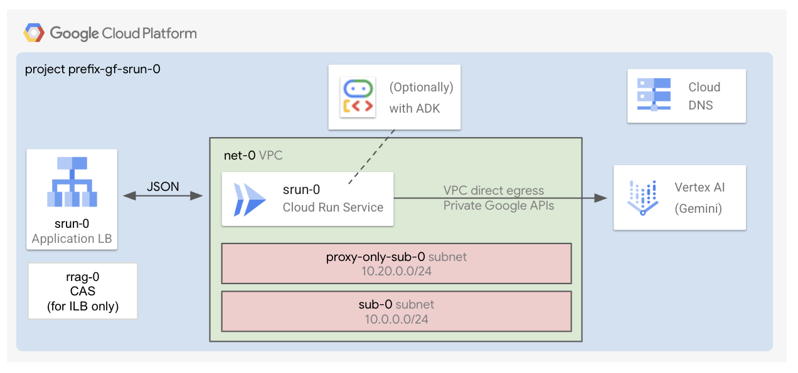

# AI Applications - Search / Platform Deployment

This stage is part of the `AI Applications - Search factory`.

It is responsible for deploying resources inside the service project you created in the [0-prereqs stage](../0-prereqs/README.md) or in an existing project.

It performs the following tasks:

- Deploys the website data store.
- Deploys the AI search application.



## Deploy the stage

This assumes you have created a project leveraging the [0-prereqs](../0-prereqs) module.

```shell
cp terraform.tfvars.sample terraform.tfvars # Customize
terraform init
terraform apply

# Follow the commands in the output.
```

## Query the search engine

Once you deployed the application, you can query the search engine by using the curl command returned in output or by using the AI Applications GUI in Google Cloud.

## Manage prerequisites independently

The [0-prereqs stage](../0-prereqs/README.md) generates the necessary Terraform input files for this stage. If you manage prerequisites independently (without the [0-prereqs stage](../0-prereqs/README.md)), you'll need to manually set values for your variables in a `terraform.tfvars` file (by following what is defined in [variables.tf](./variables.tf)), and provide a `providers.tf` file.

You can look at the template files ([1](../0-prereqs/templates/providers.tf.tpl), [2](../0-prereqs/templates/terraform.auto.tfvars.tpl)) and the [outputs.tf](../0-prereqs/outputs.tf) of the [0-prereqs](../0-prereqs/README.md) stage for more details about the structure of these files.

Do not edit the `variables-fast.tf` file. It needs to reflect FAST standards and it is used for integrating with FAST only.

### Working with Fabric FAST

This stage is fully compatible with the latest tagged version of [Fabric FAST](https://github.com/GoogleCloudPlatform/cloud-foundation-fabric/tree/master/fast).
You can create your host project and network resources by using your FAST networking stage, and your service project by using your own FAST project factory.
Once you have completed these operations, create your `providers.tf` file and make sure you drop your `auto.tfvars.json` files from FAST inside this folder. Finally, create your `terraform.tfvars` file and reference the keys of the maps imported from FAST.

Do not edit the `variables-fast.tf` file, as it needs to reflect FAST standard variable names.
<!-- BEGIN TFDOC -->
## Variables

| name | description | type | required | default |
|---|---|:---:|:---:|:---:|
| [project_id](variables.tf#L39) | The id of the project where to create the resources. | <code>string</code> | ✓ |  |
| [ai_apps_configs](variables.tf#L15) | The AI Applications configurations. | <code title="object&#40;&#123;&#10;  target_sites &#61; optional&#40;map&#40;object&#40;&#123;&#10;    provided_uri_pattern &#61; string&#10;    exact_match          &#61; optional&#40;bool, false&#41;&#10;    type                 &#61; optional&#40;string, &#34;INCLUDE&#34;&#41;&#10;    &#125;&#41;&#41;, &#123;&#10;    fabric-docs &#61; &#123;&#10;      provided_uri_pattern &#61; &#34;github.com&#47;GoogleCloudPlatform&#47;cloud-foundation-fabric&#47;&#42;&#34;&#10;    &#125;&#10;  &#125;&#41;&#10;&#125;&#41;">object&#40;&#123;&#8230;&#125;&#41;</code> |  | <code>&#123;&#125;</code> |
| [name](variables.tf#L32) | The name of the resources. This is also the project suffix if a new project is created. | <code>string</code> |  | <code>&#34;srch-0&#34;</code> |
| [region](variables.tf#L45) | The GCP region where to deploy the resources (except data store and engine). | <code>string</code> |  | <code>&#34;europe-west1&#34;</code> |

## Outputs

| name | description | sensitive |
|---|---|:---:|
| [commands](outputs.tf#L20) | Command to run after the deployment. |  |
<!-- END TFDOC -->
