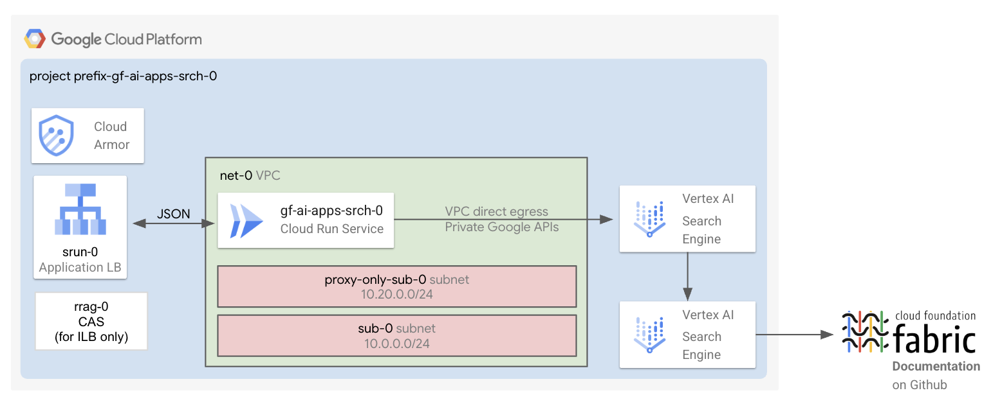

# AI Applications - Search

This module deploys an AI-powered search engine built with Google Cloud's [AI Applications](https://cloud.google.com/generative-ai-app-builder/docs/introduction) (specifically, [Vertex AI Search](https://cloud.google.com/generative-ai-app-builder/docs/create-datastore-ingest)) and hosted on Cloud Run. It's configured to search the content from a connected data store indexing the content from multiple public websites.

By default, the module indexes the [Cloud Foundation Fabric Github repository](https://github.com/GoogleCloudPlatform/cloud-foundation-fabric) content.

## Core Components

The deployment consists of the following key components:

- **AI Applications**
  - A **data store** that indexes content, such as the data from this repository's website.
  - An **engine** that connects to the data store to provide robust search capabilities.

- **Exposure Layer**
  - A **Cloud Run** deployment, configured with authentication and direct VPC egress, hosts a secure web server for the search engine.
  - A **Global external application load balancer** is included by default, featuring a Cloud Armor IP allowlist security backend policy, HTTP to HTTPS redirect, and managed certificates.
  - An **Internal application load balancer** is an optional component, offering a Cloud Armor IP allowlist security backend policy, HTTP to HTTPS redirect, managed certificates, Client Authorization Service (CAS), and a Cloud DNS private zone.

- By default, the deployment includes
  - A **Virtual Private Cloud (VPC)** with a subnet, private Google APIs routes, and DNS policies. You also have the option to integrate your existing VPCs.
  - A dedicated Google Cloud **project** with all necessary permissions is provided by default. Alternatively, you can utilize an existing project.

## Apply the factory

- Enter the [0-projects](0-projects/README.md) folder and follow the instructions to setup your GCP project, service accounts and permissions
- Go to the [1-apps](1-apps/README.md) folder and follow the instructions to deploy the components inside the project
