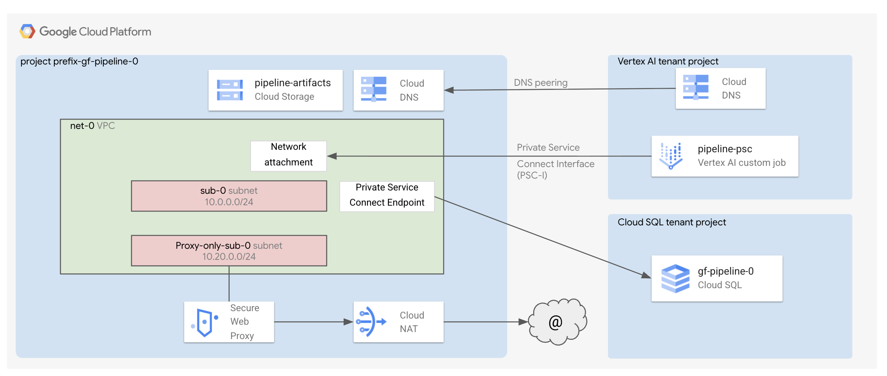

# Vertex AI Pipeline / Platform Deployment

This stage is part of the `Vertex AI pipeline factory`.
It is responsible for deploying the components enabling the AI use case, either in the project you created in [0-projects](../0-projects) or in an existing project.

This example demonstrates how to run a Vertex AI Custom Job with PSC Interface to access a private Cloud SQL database.



## Deploy the stage

This assumes you have created a project leveraging the [0-projects](../0-projects) stage.

```shell
cp terraform.tfvars.sample terraform.tfvars # Customize
terraform init
terraform apply

# Follow the commands in the output.
```

## I have not used 0-projects

The [0-projects](../0-projects) stage generates the necessary Terraform input files for this stage. If you're not using the [0-projects stage](../0-projects), you'll need to manually add the required variables to your `terraform.tfvars` file, as defined in [variables.tf](./variables.tf).
<!-- BEGIN TFDOC -->
## Variables

| name | description | type | required | default |
|---|---|:---:|:---:|:---:|
| [project_config](variables.tf#L60) | The project where to create the resources. | <code title="object&#40;&#123;&#10;  id     &#61; string&#10;  number &#61; string&#10;&#125;&#41;">object&#40;&#123;&#8230;&#125;&#41;</code> | ✓ |  |
| [db_configs](variables.tf#L15) | The Cloud SQL configurations. | <code title="object&#40;&#123;&#10;  availability_type &#61; optional&#40;string, &#34;REGIONAL&#34;&#41;&#10;  database_version  &#61; optional&#40;string, &#34;POSTGRES_14&#34;&#41;&#10;  flags             &#61; optional&#40;map&#40;string&#41;, &#123; &#34;cloudsql.iam_authentication&#34; &#61; &#34;on&#34; &#125;&#41;&#10;  tier              &#61; optional&#40;string, &#34;db-f1-micro&#34;&#41;&#10;&#125;&#41;">object&#40;&#123;&#8230;&#125;&#41;</code> |  | <code>&#123;&#125;</code> |
| [enable_deletion_protection](variables.tf#L27) | Whether deletion protection should be enabled. | <code>bool</code> |  | <code>true</code> |
| [name](variables.tf#L34) | The name of the resources. This is also the project suffix if a new project is created. | <code>string</code> |  | <code>&#34;gf-pipeline-0&#34;</code> |
| [networking_config](variables.tf#L41) | The networking configuration. | <code title="object&#40;&#123;&#10;  create &#61; optional&#40;bool, true&#41;&#10;  vpc_id &#61; optional&#40;string, &#34;net-0&#34;&#41;&#10;  subnet &#61; optional&#40;object&#40;&#123;&#10;    ip_cidr_range &#61; optional&#40;string, &#34;10.0.0.0&#47;24&#34;&#41;&#10;    name          &#61; optional&#40;string, &#34;sub-0&#34;&#41;&#10;  &#125;&#41;, &#123;&#125;&#41;&#10;  subnet_proxy_only &#61; optional&#40;object&#40;&#123;&#10;    ip_cidr_range &#61; optional&#40;string, &#34;10.20.0.0&#47;24&#34;&#41;&#10;    name          &#61; optional&#40;string, &#34;proxy-only-sub-0&#34;&#41;&#10;    purpose       &#61; optional&#40;string, &#34;REGIONAL_MANAGED_PROXY&#34;&#41;&#10;  &#125;&#41;, &#123;&#125;&#41;&#10;&#125;&#41;">object&#40;&#123;&#8230;&#125;&#41;</code> |  | <code>&#123;&#125;</code> |
| [region](variables.tf#L69) | The region where to create the resources. | <code>string</code> |  | <code>&#34;europe-west1&#34;</code> |
| [service_accounts](variables.tf#L75) | The pre-created service accounts used by the blueprint. | <code title="map&#40;object&#40;&#123;&#10;  email     &#61; string&#10;  iam_email &#61; string&#10;  id        &#61; string&#10;&#125;&#41;&#41;">map&#40;object&#40;&#123;&#8230;&#125;&#41;&#41;</code> |  | <code>&#123;&#125;</code> |

## Outputs

| name | description | sensitive |
|---|---|:---:|
| [commands](outputs.tf#L31) | Run the following commands when the deployment completes to deploy the app. |  |
<!-- END TFDOC -->
