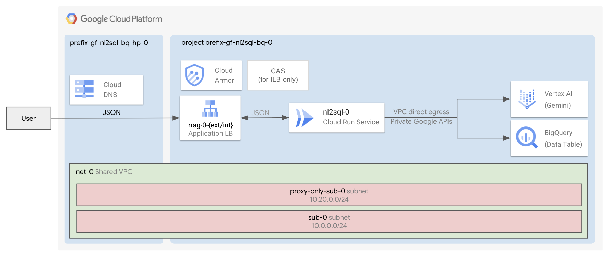

# Natural Language to SQL (NL2SQL) for BigQuery

This factory deploys a "Natural Language 2 SQL" (NL2SQL) system on Cloud Run to query a dataset in BigQuery.

A Cloud Run job periodically ingests sample [movies data](./1-apps/data/top-100-imdb-movies.csv) from BigQuery, creates embeddings and stores them in an AlloyDB database. Another Cloud Run frontend application leverages the text embeddings from the AlloyDB database and answers questions on these movies in json format.

The deployment includes:

- A **database**: an instance of BigQuery. You will upload some public data to it.

- An **agent** running on **Cloud Run** (configured with authentication and direct VPC egress)

- An **exposure layer** that allows you to securely access your instance of Cloud Run, made of:
  - a **Global external application load balancer** (+ Cloud Armor IP allowlist security backend policy + HTTP to HTTPS redirect + managed certificates). This is created by default.
  - an **Internal application load balancer** (+ Cloud Armor IP allowlist security backend policy + HTTP to HTTPS redirect + managed certificates + CAS + Cloud DNS private zone). This is optional.

- By default, a **VPC**, a subnet, private Google APIs routes and DNS policies. Optionally, can use your existing VPCs.
- By default, a **project** with all the necessary permissions. Optionally, can use your existing project.

## Apply the factory

- Enter the [0-projects](0-projects/README.md) folder and follow the instructions to setup your GCP project, service accounts and permissions
- Go to the [1-apps](1-apps/README.md) folder and follow the instructions to deploy the components inside the project
