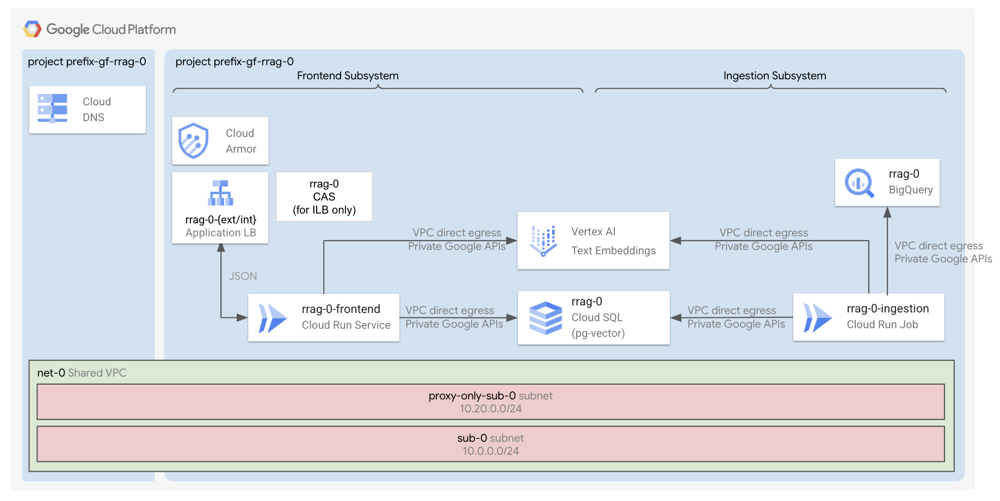

# RAG with Cloud Run and Cloud SQL

This module deploys a "Retrieval-Augmented Generation" (RAG) system, leveraging Cloud Run, Cloud SQL and BigQuery. For the same architecture using AlloyDB instead of Cloud SQL, consult the [corresponding folder](../cloud-run-rag-alloydb/README.md).

A Cloud Run job periodically ingests sample [movies data](./1-apps/data/top-100-imdb-movies.csv) from BigQuery, creates embeddings and stores them in a Cloud SQL database (with pgvector). Another Cloud Run frontend application leverages the text embeddings from the Cloud SQL database and answers questions on these movies in json format.

## Core Components

The deployment includes:

- An **ingestion subsystem**, made of a private **Cloud Run job** with direct egress access to the user VPC, that reads sample data from **BigQuery**, leverages the **Vertex Text Embeddings APIs** and stores results in **Cloud SQL**

- **Databases**:
	- A **BigQuery dataset**, where users store their data to augment the model
	- A private **Cloud SQL** instance where the ingestion job stores the text embeddings.
	  By default, this is PostgreSQL with the pgvector extension enabled.

- A **frontend subsystem**, made of:
	- **Global external application load balancer** (+ Cloud Armor IP allowlist security backend policy + HTTP to HTTPS redirect + managed certificates). This is created by default.
	- **Internal application load balancer** (+ Cloud Armor IP allowlist security backend policy + HTTP to HTTPS redirect + managed certificates + CAS + Cloud DNS private zone). This is not created by default.
	- A private **Cloud Run** frontend with direct egress access to the user VPC, that answers user queries in json format, based on the text embeddings contained in the Cloud SQL database.

- By default, a **host project**, a **shared VPC**, a subnet, private Google APIs routes and DNS policies. Optionally, you can use your own host project and shared VPCs.

- A **service project** with all the necessary APIs, service accounts, permissions set.

## Apply the factory

- Enter the [0-prereqs](0-prereqs/README.md) folder and follow the instructions to setup your GCP project, service accounts and permissions
- Go to the [1-apps](1-apps/README.md) folder and follow the instructions to deploy the components inside the project
