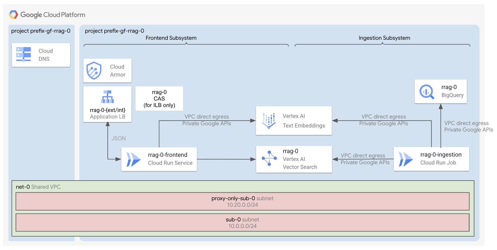

# Cloud Run - RAG with Vector Search / Platform and Agent Deployment

This stage is part of the `Cloud Run RAG - Cloud SQL` factory.

It performs the following tasks:

- Deploys the Cloud Run services for ingestion and serving the frontend agent.
- Deploys a Vector Search database where to store the embeddings.
- Creates a storage bucket where we store the initial data.
- Optionally, creates external and/or internal load balancers with custom domains.
- Optionally, sets up Certificate Authority Service (CAS) and Certificate Manager to generate and store your Internal Load Balancers certificates.

It deploys resources inside the service project you created in the [0-prereqs stage](../0-prereqs/README.md) or in an existing project.



## Deploy the stage

If you created your project(s) through [0-prereqs](../0-prereqs/README.md), you should already see in this folder a `providers.tf` and a `terraform.auto.tfvars` file.

```shell
cp terraform.tfvars.sample terraform.tfvars # Customize
terraform init
terraform apply

# Follow the commands in the output.
```

## Query the applications

Once the applications have been deployed, learn sample commands to test them:

- [RAG](./apps/rag/frontend/README.md)

## Manage prerequisites independently

The [0-prereqs stage](../0-prereqs/README.md) generates the necessary Terraform input files for this stage. If you manage prerequisites independently (without the [0-prereqs stage](../0-prereqs/README.md)), you'll need to manually set values for your variables in a `terraform.tfvars` file (by following what is defined in [variables.tf](./variables.tf)), and provide a `providers.tf` file.

You can look at the template files ([1](../0-prereqs/templates/providers.tf.tpl), [2](../0-prereqs/templates/terraform.auto.tfvars.tpl)) and the [outputs.tf](../0-prereqs/outputs.tf) of the [0-prereqs](../0-prereqs/README.md) stage for more details about the structure of these files.

Do not edit the `variables-fast.tf` file. It needs to reflect FAST standards and it is used for integrating with FAST only.

### Working with Fabric FAST

This stage is fully compatible with the latest tagged version of [Fabric FAST](https://github.com/GoogleCloudPlatform/cloud-foundation-fabric/tree/master/fast).
You can create your host project and network resources by using your FAST networking stage, and your service project by using your own FAST project factory.
Once you have completed these operations, create your `providers.tf` file and make sure you drop your `auto.tfvars.json` files from FAST inside this folder. Finally, create your `terraform.tfvars` file and reference the keys of the maps imported from FAST.

Do not edit the `variables-fast.tf` file, as it needs to reflect FAST standard variable names.
<!-- BEGIN TFDOC -->
## Variables

| name | description | type | required | default |
|---|---|:---:|:---:|:---:|
| [networking_config](variables.tf#L121) | The networking configuration. Each element is either the id of the resource or the key of the map var.vpc_self_links. | <code title="object&#40;&#123;&#10;  subnet &#61; string&#10;  vpc    &#61; string&#10;&#125;&#41;">object&#40;&#123;&#8230;&#125;&#41;</code> | ✓ |  |
| [prefix](variables.tf#L131) | The prefix to use for resources with globally unique names. | <code>string</code> | ✓ |  |
| [project_id](variables.tf#L137) | The id of the project where to create the resources. | <code>string</code> | ✓ |  |
| [region](variables.tf#L143) | The GCP region where to deploy the resources. | <code>string</code> | ✓ |  |
| [service_account_emails](variables.tf#L150) | The service account emails. Each element is the email of the service account or the key of the map var.service_accounts. | <code>map&#40;string&#41;</code> | ✓ |  |
| [service_account_ids](variables.tf#L157) | The service account ids. Each element is the id of the service account or the key of the map var.service_accounts. | <code>map&#40;string&#41;</code> | ✓ |  |
| [ca_pool_name_suffix](variables.tf#L18) | The name suffix of the CA pool used for app ILB certificates. | <code>string</code> |  | <code>&#34;ca-pool-0&#34;</code> |
| [cloud_run_configs](variables.tf#L25) | The Cloud Run configurations. | <code title="object&#40;&#123;&#10;  frontend &#61; object&#40;&#123;&#10;    containers &#61; optional&#40;map&#40;any&#41;, &#123;&#10;      frontend &#61; &#123;&#10;        image &#61; &#34;us-docker.pkg.dev&#47;cloudrun&#47;container&#47;hello&#34;&#10;        ports &#61; &#123;&#10;          frontend &#61; &#123;&#10;            container_port &#61; 8080&#10;          &#125;&#10;        &#125;&#10;      &#125;&#10;    &#125;&#41;&#10;    deletion_protection &#61; optional&#40;bool, true&#41;&#10;    ingress             &#61; optional&#40;string, &#34;INGRESS_TRAFFIC_INTERNAL_LOAD_BALANCER&#34;&#41;&#10;    max_instance_count  &#61; optional&#40;number, 3&#41;&#10;    min_instance_count  &#61; optional&#40;number, 1&#41;&#10;    service_invokers    &#61; optional&#40;list&#40;string&#41;, &#91;&#93;&#41;&#10;    vpc_access_egress   &#61; optional&#40;string, &#34;ALL_TRAFFIC&#34;&#41;&#10;    vpc_access_tags     &#61; optional&#40;list&#40;string&#41;, &#91;&#93;&#41;&#10;  &#125;&#41;&#10;  ingestion &#61; object&#40;&#123;&#10;    containers &#61; optional&#40;map&#40;any&#41;, &#123;&#10;      ingestion &#61; &#123;&#10;        image &#61; &#34;us-docker.pkg.dev&#47;cloudrun&#47;container&#47;hello&#34;&#10;      &#125;&#10;    &#125;&#41;&#10;    deletion_protection &#61; optional&#40;bool, true&#41;&#10;    ingress             &#61; optional&#40;string, &#34;INGRESS_TRAFFIC_INTERNAL_ONLY&#34;&#41;&#10;    max_instance_count  &#61; optional&#40;number, 3&#41;&#10;    min_instance_count  &#61; optional&#40;number, 1&#41;&#10;    service_invokers    &#61; optional&#40;list&#40;string&#41;, &#91;&#93;&#41;&#10;    vpc_access_egress   &#61; optional&#40;string, &#34;ALL_TRAFFIC&#34;&#41;&#10;    vpc_access_tags     &#61; optional&#40;list&#40;string&#41;, &#91;&#93;&#41;&#10;  &#125;&#41;&#10;&#125;&#41;">object&#40;&#123;&#8230;&#125;&#41;</code> |  | <code title="&#123;&#10;  frontend  &#61; &#123;&#125;&#10;  ingestion &#61; &#123;&#125;&#10;&#125;">&#123;&#8230;&#125;</code> |
| [enable_deletion_protection](variables.tf#L69) | Whether deletion protection should be enabled. | <code>bool</code> |  | <code>true</code> |
| [ingestion_schedule_configs](variables.tf#L76) | The configuration of the Cloud Scheduler that calls invokes the Cloud Run ingestion job. | <code title="object&#40;&#123;&#10;  attempt_deadline &#61; optional&#40;string, &#34;60s&#34;&#41;&#10;  retry_count      &#61; optional&#40;number, 1&#41;&#10;  schedule         &#61; optional&#40;string, &#34;&#42;&#47;30 &#42; &#42; &#42; &#42;&#34;&#41;&#10;&#125;&#41;">object&#40;&#123;&#8230;&#125;&#41;</code> |  | <code>&#123;&#125;</code> |
| [lbs_configs](variables.tf#L87) | The load balancers configurations. | <code title="object&#40;&#123;&#10;  external &#61; optional&#40;object&#40;&#123;&#10;    enable &#61; optional&#40;bool, true&#41;&#10;    ip_address        &#61; optional&#40;string&#41;&#10;    domain            &#61; optional&#40;string, &#34;example.com&#34;&#41;&#10;    allowed_ip_ranges &#61; optional&#40;list&#40;string&#41;, &#91;&#34;0.0.0.0&#47;0&#34;&#93;&#41;&#10;  &#125;&#41;, &#123;&#125;&#41;&#10;  internal &#61; optional&#40;object&#40;&#123;&#10;    enable &#61; optional&#40;bool, false&#41;&#10;    ip_address        &#61; optional&#40;string&#41;&#10;    domain            &#61; optional&#40;string, &#34;example.com&#34;&#41;&#10;    allowed_ip_ranges &#61; optional&#40;list&#40;string&#41;, &#91;&#34;0.0.0.0&#47;0&#34;&#93;&#41;&#10;  &#125;&#41;, &#123;&#125;&#41;&#10;&#125;&#41;">object&#40;&#123;&#8230;&#125;&#41;</code> |  | <code title="&#123;&#10;  external &#61; &#123;&#125;&#10;  internal &#61; &#123;&#125;&#10;&#125;">&#123;&#8230;&#125;</code> |
| [name](variables.tf#L114) | The name of the resources. This is also the project suffix if a new project is created. | <code>string</code> |  | <code>&#34;gf-rrag-search-0&#34;</code> |
| [service_accounts](variables-fast.tf#L18) | The service accounts created for this stage. | <code title="map&#40;object&#40;&#123;&#10;  email     &#61; string&#10;  iam_email &#61; string&#10;  id        &#61; string&#10;&#125;&#41;&#41;">map&#40;object&#40;&#123;&#8230;&#125;&#41;&#41;</code> |  | <code>&#123;&#125;</code> |
| [subnet_self_links](variables-fast.tf#L30) | Shared VPCs subnet IDs. | <code>map&#40;string&#41;</code> |  | <code>&#123;&#125;</code> |
| [vector_search_config](variables.tf#L163) | The VertexAI index configuration. | <code title="object&#40;&#123;&#10;  algorithm_config &#61; optional&#40;object&#40;&#123;&#10;    tree_ah_config &#61; optional&#40;object&#40;&#123;&#10;      leaf_node_embedding_count    &#61; optional&#40;number, 500&#41;&#10;      leaf_nodes_to_search_percent &#61; optional&#40;number, 7&#41;&#10;    &#125;&#41;, &#123;&#125;&#41;&#10;  &#125;&#41;, &#123;&#125;&#41;&#10;  approximate_neighbors_count &#61; optional&#40;number, 150&#41;&#10;  dimensions                  &#61; optional&#40;number, 768&#41;&#10;  distance_measure_type       &#61; optional&#40;string, &#34;DOT_PRODUCT_DISTANCE&#34;&#41;&#10;  index_shard_size            &#61; optional&#40;string, &#34;SHARD_SIZE_SMALL&#34;&#41;&#10;  index_update_method         &#61; optional&#40;string, &#34;STREAM_UPDATE&#34;&#41;&#10;  deployment_tier             &#61; optional&#40;string, &#34;STORAGE&#34;&#41;&#10;  machine_type &#61; optional&#40;string, &#34;e2-standard-2&#34;&#41;&#10;  max_replica_count &#61; optional&#40;number, 2&#41;&#10;  min_replica_count &#61; optional&#40;number, 2&#41;&#10;&#125;&#41;">object&#40;&#123;&#8230;&#125;&#41;</code> |  | <code>&#123;&#125;</code> |
| [vpc_self_links](variables-fast.tf#L38) | Shared VPC name => self link mappings. | <code>map&#40;string&#41;</code> |  | <code>&#123;&#125;</code> |

## Outputs

| name | description | sensitive |
|---|---|:---:|
| [commands](outputs.tf#L53) | Run the following commands when the deployment completes to deploy the app. |  |
| [ip_addresses](outputs.tf#L103) | The load balancers IP addresses. |  |
<!-- END TFDOC -->
