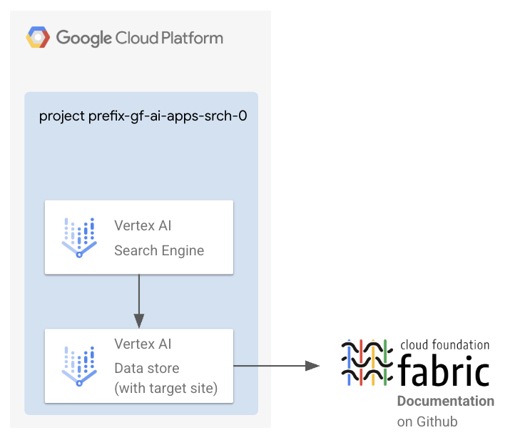

# RAG with Cloud Run and Vector Search

The factory deploys a "Retrieval-Augmented Generation" (RAG) system, leveraging Cloud Run and Vector Search.

A Cloud Run job periodically ingests sample [movies data](./1-apps/data/data.jsonl) from Cloud Storage. It creates embeddings and stores them in Vector Search. Another Cloud Run frontend application leverages the embeddings from Vector Search and answers questions on movies in json format.

## Core Components

The deployment includes:

- An **ingestion subsystem**, made of a private **Cloud Run job** with direct egress access to the user VPC, that reads sample data from **Cloud Storage**, leverages the **Vertex Text Embeddings APIs** and stores results in **Vector Search**

- **Databases**:
	- **Vector Search**, where users store embeddings to augment the model

- A **frontend subsystem**, made of:
	- **Global external application load balancer** (+ Cloud Armor IP allowlist security backend policy + HTTP to HTTPS redirect + managed certificates). This is created by default.
	- **Internal application load balancer** (+ Cloud Armor IP allowlist security backend policy + HTTP to HTTPS redirect + managed certificates + CAS + Cloud DNS private zone). This is not created by default.
	- A private **Cloud Run** frontend with direct egress access to the user VPC, that answers user queries in json format, based on the text embeddings contained in Vector Search.

- By default, a **VPC**, a subnet, private Google APIs routes and DNS policies. Optionally, can use your existing VPCs.
- By default, a **project** with all the necessary permissions. Optionally, can use your existing project.

## Apply the factory

- Enter the [0-projects](0-projects/README.md) folder and follow the instructions to setup your GCP project, service accounts and permissions
- Go to the [1-apps](1-apps/README.md) folder and follow the instructions to deploy the components inside the project
