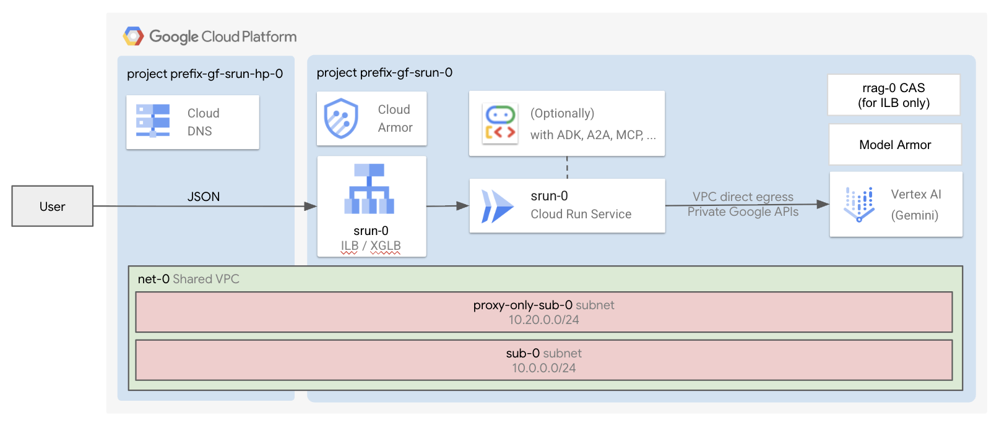

# Cloud Run - Single / Platform Deployment

This stage is part of `Cloud Run - Single` factory.
It is responsible for deploying resources inside the project you created in [0-projects](../0-prereqs) or in an existing project.



## Deploy the stage

This assumes you have created a project leveraging the [0-projects](../0-prereqs) stage.

```shell
cp terraform.tfvars.sample terraform.tfvars # Customize
terraform init
terraform apply

# Follow the commands in the output.
```

## Query the applications

Once the applications have been deployed, learn sample commands to test them:

- [Chat](./apps/chat/README.md)
- [ADK](./apps/adk/README.md)
- [ADK with A2A](./apps/adk-a2a/README.md).
- [Gemma3](./apps/gemma/README.md)
- [MCP server](./apps/mcp-server/README.md)

## I have not used 0-projects

The [0-projects](../0-prereqs) stage generates the necessary Terraform input files for this stage. If you're not using the [0-projects stage](../0-prereqs), you'll need to manually add the required variables to your `terraform.tfvars` file, as defined in [variables.tf](./variables.tf).
<!-- BEGIN TFDOC -->
## Variables

| name | description | type | required | default |
|---|---|:---:|:---:|:---:|
| [networking_config](variables.tf#L207) | The networking configuration. These must be either the ids of the resources or the keys of the map vpc_self_links. | <code title="object&#40;&#123;&#10;  subnet            &#61; string&#10;  subnet_proxy_only &#61; string&#10;  vpc               &#61; string&#10;&#125;&#41;">object&#40;&#123;&#8230;&#125;&#41;</code> | ✓ |  |
| [project_id](variables.tf#L217) | The id of the project where to create the resources. | <code>string</code> | ✓ |  |
| [service_account_emails](variables.tf#L229) | The pre-created service accounts. Each is the email or the key of the map var.service_accounts. | <code>map&#40;string&#41;</code> | ✓ |  |
| [ca_pool_name_suffix](variables.tf#L18) | The name suffix of the CA pool used for app ILB certificates. | <code>string</code> |  | <code>&#34;ca-pool-0&#34;</code> |
| [cloud_run_configs](variables.tf#L25) | The Cloud Run configurations. | <code title="object&#40;&#123;&#10;  containers &#61; optional&#40;map&#40;any&#41;, &#123;&#10;    ai &#61; &#123;&#10;      image &#61; &#34;us-docker.pkg.dev&#47;cloudrun&#47;container&#47;hello&#34;&#10;    &#125;&#10;  &#125;&#41;&#10;  gpu_zonal_redundancy_disabled &#61; optional&#40;bool, null&#41;&#10;  ingress                       &#61; optional&#40;string, &#34;INGRESS_TRAFFIC_INTERNAL_LOAD_BALANCER&#34;&#41;&#10;  max_instance_count            &#61; optional&#40;number, 3&#41;&#10;  min_instance_count            &#61; optional&#40;number, 1&#41;&#10;  node_selector                 &#61; optional&#40;map&#40;string&#41;, null&#41;&#10;  service_invokers              &#61; optional&#40;list&#40;string&#41;, &#91;&#93;&#41;&#10;  vpc_access_egress             &#61; optional&#40;string, &#34;ALL_TRAFFIC&#34;&#41;&#10;  vpc_access_tags               &#61; optional&#40;list&#40;string&#41;, &#91;&#93;&#41;&#10;&#125;&#41;">object&#40;&#123;&#8230;&#125;&#41;</code> |  | <code>&#123;&#125;</code> |
| [enable_deletion_protection](variables.tf#L46) | Whether deletion protection should be enabled. | <code>bool</code> |  | <code>true</code> |
| [lbs_config](variables.tf#L53) | The load balancers configuration. | <code title="object&#40;&#123;&#10;  external &#61; optional&#40;object&#40;&#123;&#10;    enable &#61; optional&#40;bool, true&#41;&#10;    ip_address        &#61; optional&#40;string&#41;&#10;    domain            &#61; optional&#40;string, &#34;example.com&#34;&#41;&#10;    allowed_ip_ranges &#61; optional&#40;list&#40;string&#41;, &#91;&#34;0.0.0.0&#47;0&#34;&#93;&#41;&#10;  &#125;&#41;, &#123;&#125;&#41;&#10;  internal &#61; optional&#40;object&#40;&#123;&#10;    enable &#61; optional&#40;bool, false&#41;&#10;    ip_address        &#61; optional&#40;string&#41;&#10;    domain            &#61; optional&#40;string, &#34;example.com&#34;&#41;&#10;    allowed_ip_ranges &#61; optional&#40;list&#40;string&#41;, &#91;&#34;0.0.0.0&#47;0&#34;&#93;&#41;&#10;  &#125;&#41;, &#123;&#125;&#41;&#10;&#125;&#41;">object&#40;&#123;&#8230;&#125;&#41;</code> |  | <code title="&#123;&#10;  external &#61; &#123;&#125;&#10;  internal &#61; &#123;&#125;&#10;&#125;">&#123;&#8230;&#125;</code> |
| [model_armor_floorsetting_config](variables.tf#L80) | The default model armor configuration for Vertex AI in your project. | <code title="object&#40;&#123;&#10;  enabled          &#61; optional&#40;bool, true&#41;&#10;  enforcement_type &#61; optional&#40;string, &#34;INSPECT_AND_BLOCK&#34;&#41;&#10;  logging          &#61; optional&#40;bool, true&#41;&#10;  sdp &#61; optional&#40;object&#40;&#123;&#10;    enabled &#61; optional&#40;string, &#34;ENABLED&#34;&#41;&#10;  &#125;&#41;, &#123;&#125;&#41;&#10;  malicious_uri &#61; optional&#40;object&#40;&#123;&#10;    enabled &#61; optional&#40;string, &#34;ENABLED&#34;&#41;&#10;  &#125;&#41;, &#123;&#125;&#41;&#10;  pi_and_jailbreak &#61; optional&#40;object&#40;&#123;&#10;    enabled          &#61; optional&#40;string, &#34;ENABLED&#34;&#41;&#10;    confidence_level &#61; optional&#40;string, &#34;HIGH&#34;&#41;&#10;  &#125;&#41;, &#123;&#125;&#41;&#10;  rai_filters &#61; optional&#40;object&#40;&#123;&#10;    HATE_SPEECH       &#61; optional&#40;string, &#34;HIGH&#34;&#41;&#10;    DANGEROUS         &#61; optional&#40;string, &#34;HIGH&#34;&#41;&#10;    HARASSMENT        &#61; optional&#40;string, &#34;HIGH&#34;&#41;&#10;    SEXUALLY_EXPLICIT &#61; optional&#40;string, &#34;HIGH&#34;&#41;&#10;  &#125;&#41;, &#123;&#125;&#41;&#10;&#125;&#41;">object&#40;&#123;&#8230;&#125;&#41;</code> |  | <code>&#123;&#125;</code> |
| [model_armor_template_config](variables.tf#L140) | The model armor configuration for your application. | <code title="object&#40;&#123;&#10;  enabled          &#61; optional&#40;bool, true&#41;&#10;  enforcement_type &#61; optional&#40;string, &#34;INSPECT_AND_BLOCK&#34;&#41;&#10;  logging          &#61; optional&#40;bool, true&#41;&#10;  sdp &#61; optional&#40;object&#40;&#123;&#10;    enabled &#61; optional&#40;string, &#34;ENABLED&#34;&#41;&#10;  &#125;&#41;, &#123;&#125;&#41;&#10;  malicious_uri &#61; optional&#40;object&#40;&#123;&#10;    enabled &#61; optional&#40;string, &#34;ENABLED&#34;&#41;&#10;  &#125;&#41;, &#123;&#125;&#41;&#10;  pi_and_jailbreak &#61; optional&#40;object&#40;&#123;&#10;    enabled          &#61; optional&#40;string, &#34;ENABLED&#34;&#41;&#10;    confidence_level &#61; optional&#40;string, &#34;HIGH&#34;&#41;&#10;  &#125;&#41;, &#123;&#125;&#41;&#10;  rai_filters &#61; optional&#40;object&#40;&#123;&#10;    HATE_SPEECH       &#61; optional&#40;string, &#34;HIGH&#34;&#41;&#10;    DANGEROUS         &#61; optional&#40;string, &#34;HIGH&#34;&#41;&#10;    HARASSMENT        &#61; optional&#40;string, &#34;HIGH&#34;&#41;&#10;    SEXUALLY_EXPLICIT &#61; optional&#40;string, &#34;HIGH&#34;&#41;&#10;  &#125;&#41;, &#123;&#125;&#41;&#10;&#125;&#41;">object&#40;&#123;&#8230;&#125;&#41;</code> |  | <code>&#123;&#125;</code> |
| [name](variables.tf#L200) | The name of the resources. This is also the project suffix if a new project is created. | <code>string</code> |  | <code>&#34;gf-srun-0&#34;</code> |
| [region](variables.tf#L222) | The GCP region where to deploy the resources. | <code>string</code> |  | <code>&#34;europe-west1&#34;</code> |
| [service_accounts](variables-fast.tf#L18) | The service accounts created for this stage. | <code title="map&#40;object&#40;&#123;&#10;  email     &#61; string&#10;  iam_email &#61; string&#10;  id        &#61; string&#10;&#125;&#41;&#41;">map&#40;object&#40;&#123;&#8230;&#125;&#41;&#41;</code> |  | <code>&#123;&#125;</code> |
| [subnet_self_links](variables-fast.tf#L30) | Shared VPCs subnet IDs. | <code>map&#40;map&#40;string&#41;&#41;</code> |  | <code>&#123;&#125;</code> |
| [vpc_self_links](variables-fast.tf#L38) | Shared VPC name => self link mappings. | <code>map&#40;string&#41;</code> |  | <code>&#123;&#125;</code> |

## Outputs

| name | description | sensitive |
|---|---|:---:|
| [commands](outputs.tf#L24) | Run the following commands when the deployment completes to deploy the app. |  |
| [ip_addresses](outputs.tf#L78) | The load balancers IP addresses. |  |
<!-- END TFDOC -->
