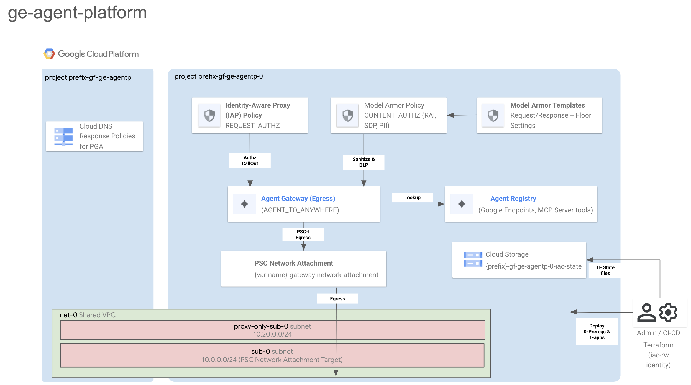

# Agent Platform / Platform and Gateway Deployment



This stage is part of the `Gemini Enterprise Agent Platform` factory.

It is responsible for deploying the components enabling the Agent Platform architecture inside the service project created in [0-prereqs](../0-prereqs/README.md) or in an existing project.

It performs the following tasks:

- Creates a Private Service Connect (PSC) Network Attachment in the service project pointing to the Shared VPC subnet.
- Deploys the Egress Agent Gateway configured with `AGENT_TO_ANYWHERE` access path.
- Configures dynamic authorization extensions and policies:
  - **Model Armor** (`CONTENT_AUTHZ`): Inspects and sanitizes LLM prompt requests and model responses using configured Model Armor templates.
  - **Identity-Aware Proxy (IAP)** (`REQUEST_AUTHZ`): Enforces identity verification and access control on incoming requests.
- Registers service endpoints in **Agent Registry**:
  - Automatically registers Google APIs (Vertex AI, Dialogflow, Discovery Engine, Model Armor, Cloud Logging, Cloud Monitoring) across multiple endpoint variants (global, mTLS, regional, regional mTLS, and Regional Endpoint Protocol / REP).
  - Registers custom HTTP/gRPC endpoints defined in `var.custom_services` with JSONRPC protocol binding.

## Deploy the stage

If you created your project(s) through [0-prereqs](../0-prereqs/README.md), you should already see a `providers.tf` and a `terraform.auto.tfvars` file in this folder.

```shell
terraform init
terraform apply
```

## Authorization Policies

The stage configures dedicated authorization extensions and policies directly on the Agent Gateway using `var.agent_gateway_config`:

- **Identity-Aware Proxy (IAP)** (`REQUEST_AUTHZ`): Enforces IAM allow policies on target services per request. Enabled by default with configurable enforcement mode (`DRY_RUN` or `ENFORCED`), policy version (`V2`), and timeout.
- **Model Armor** (`CONTENT_AUTHZ`): Enables content inspection via Service Extensions. Filter configuration (RAI filters, prompt injection & jailbreak detection, malicious URI, and Sensitive Data Protection) and project-level floor settings are configured via `var.model_armor_template_config`. The gateway policy can optionally be scoped to specific host headers via `authz_hosts`.

To configure authorization policies, customize your `terraform.tfvars`:

```hcl
agent_gateway_config = {
  access_path = "AGENT_TO_ANYWHERE"
  iap = {
    enable               = true
    iam_enforcement_mode = "DRY_RUN"
    policy_version       = "V2"
  }
  model_armor = {
    enable = true
    # Optional: scope to specific host headers
    # authz_hosts = ["example.internal"]
  }
}
```

## Registering Custom Services

You can register your own tools or backend services in Agent Registry by setting the `custom_services` variable:

```hcl
custom_services = [
  {
    id           = "weather-service"
    display_name = "Weather API Service"
    url          = "https://weather.example.com"
    description  = "Internal weather forecast service"
  }
]
```

## Manage prerequisites independently

The [0-prereqs stage](../0-prereqs/README.md) generates the necessary Terraform input files for this stage. If you manage prerequisites independently (without the [0-prereqs stage](../0-prereqs/README.md)), you'll need to manually set values for your variables in a `terraform.tfvars` file (by following what is defined in [variables.tf](./variables.tf)), and provide a `providers.tf` file.

You can look at the template files ([1](../0-prereqs/templates/providers.tf.tpl), [2](../0-prereqs/templates/terraform.auto.tfvars.tpl)) and the [outputs.tf](../0-prereqs/outputs.tf) of the [0-prereqs](../0-prereqs/README.md) stage for more details about the structure of these files.

### Working with Fabric FAST

This stage is fully compatible with the latest tagged version of [Fabric FAST](https://github.com/GoogleCloudPlatform/cloud-foundation-fabric/tree/master/fast).
You can create your host project and network resources using your FAST networking stage, and your service project using your own FAST project factory.
<!-- BEGIN TFDOC -->
## Variables

| name | description | type | required | default |
|---|---|:---:|:---:|:---:|
| [networking_config](variables.tf#L182) | The networking configuration. Each element is either the id of the resource or the key of the map var.vpc_self_links. | <code title="object&#40;&#123;&#10;  subnet &#61; string&#10;  vpc    &#61; string&#10;&#125;&#41;">object&#40;&#123;&#8230;&#125;&#41;</code> | ✓ |  |
| [project_id](variables.tf#L191) | The id of the project where to create the resources. | <code>string</code> | ✓ |  |
| [agent_gateway_config](variables.tf#L15) | Agent Gateway configuration including authorization extensions. | <code title="object&#40;&#123;&#10;  access_path &#61; optional&#40;string, &#34;AGENT_TO_ANYWHERE&#34;&#41;&#10;  iap &#61; optional&#40;object&#40;&#123;&#10;    fail_open            &#61; optional&#40;bool, true&#41;&#10;    iam_enforcement_mode &#61; optional&#40;string, &#34;DRY_RUN&#34;&#41;&#10;    policy_version       &#61; optional&#40;string, &#34;V2&#34;&#41;&#10;    timeout              &#61; optional&#40;string, &#34;2s&#34;&#41;&#10;  &#125;&#41;, &#123;&#125;&#41;&#10;  model_armor &#61; optional&#40;object&#40;&#123;&#10;    authz_hosts &#61; optional&#40;list&#40;string&#41;, &#91;&#93;&#41;&#10;    enable      &#61; optional&#40;bool, false&#41;&#10;    fail_open   &#61; optional&#40;bool, true&#41;&#10;    timeout     &#61; optional&#40;string, &#34;2s&#34;&#41;&#10;  &#125;&#41;, &#123;&#125;&#41;&#10;&#125;&#41;">object&#40;&#123;&#8230;&#125;&#41;</code> |  | <code>&#123;&#125;</code> |
| [custom_services](variables.tf#L35) | List of custom (non-Google) service endpoints to register in Agent Registry. | <code title="list&#40;object&#40;&#123;&#10;  id           &#61; string&#10;  display_name &#61; string&#10;  url          &#61; string&#10;  description  &#61; optional&#40;string&#41;&#10;&#125;&#41;&#41;">list&#40;object&#40;&#123;&#8230;&#125;&#41;&#41;</code> |  | <code>&#91;&#93;</code> |
| [google_apis](variables.tf#L46) | Map of Google API IDs to display names to register in Agent Registry. | <code>map&#40;string&#41;</code> |  | <code title="&#123;&#10;  &#34;dialogflow&#34;      &#61; &#34;Dialogflow API&#34;&#10;  &#34;discoveryengine&#34; &#61; &#34;Discovery Engine API&#34;&#10;  &#34;modelarmor&#34;      &#61; &#34;Model Armor API&#34;&#10;  &#34;storage&#34;         &#61; &#34;Cloud Storage API&#34;&#10;  &#34;aiplatform&#34;      &#61; &#34;Vertex AI API&#34;&#10;  &#34;logging&#34;         &#61; &#34;Cloud Logging API&#34;&#10;  &#34;monitoring&#34;      &#61; &#34;Cloud Monitoring API&#34;&#10;&#125;">&#123;&#8230;&#125;</code> |
| [model_armor_template_config](variables.tf#L60) | The Model Armor configuration for templates and floor settings. | <code title="object&#40;&#123;&#10;  enabled          &#61; optional&#40;bool, true&#41;&#10;  enforcement_type &#61; optional&#40;string, &#34;INSPECT_AND_BLOCK&#34;&#41;&#10;  logging          &#61; optional&#40;bool, true&#41;&#10;&#10;&#10;  request_template_id  &#61; optional&#40;string, &#34;agw-request-template&#34;&#41;&#10;  response_template_id &#61; optional&#40;string, &#34;agw-response-template&#34;&#41;&#10;  sdp &#61; optional&#40;object&#40;&#123;&#10;    enabled &#61; optional&#40;string, &#34;ENABLED&#34;&#41;&#10;  &#125;&#41;, &#123;&#125;&#41;&#10;  malicious_uri &#61; optional&#40;object&#40;&#123;&#10;    enabled &#61; optional&#40;string, &#34;ENABLED&#34;&#41;&#10;  &#125;&#41;, &#123;&#125;&#41;&#10;  pi_and_jailbreak &#61; optional&#40;object&#40;&#123;&#10;    confidence_level &#61; optional&#40;string, &#34;HIGH&#34;&#41;&#10;    enabled          &#61; optional&#40;string, &#34;ENABLED&#34;&#41;&#10;  &#125;&#41;, &#123;&#125;&#41;&#10;  rai_filters &#61; optional&#40;object&#40;&#123;&#10;    DANGEROUS         &#61; optional&#40;string, &#34;HIGH&#34;&#41;&#10;    HARASSMENT        &#61; optional&#40;string, &#34;HIGH&#34;&#41;&#10;    HATE_SPEECH       &#61; optional&#40;string, &#34;HIGH&#34;&#41;&#10;    SEXUALLY_EXPLICIT &#61; optional&#40;string, &#34;HIGH&#34;&#41;&#10;  &#125;&#41;, &#123;&#125;&#41;&#10;  floor_setting &#61; optional&#40;object&#40;&#123;&#10;    enabled          &#61; optional&#40;bool, false&#41;&#10;    enforcement_type &#61; optional&#40;string, &#34;INSPECT_AND_BLOCK&#34;&#41;&#10;    logging          &#61; optional&#40;bool, true&#41;&#10;&#10;&#10;    sdp &#61; optional&#40;object&#40;&#123;&#10;      enabled &#61; optional&#40;string, &#34;ENABLED&#34;&#41;&#10;    &#125;&#41;, &#123;&#125;&#41;&#10;&#10;&#10;    malicious_uri &#61; optional&#40;object&#40;&#123;&#10;      enabled &#61; optional&#40;string, &#34;ENABLED&#34;&#41;&#10;    &#125;&#41;, &#123;&#125;&#41;&#10;&#10;&#10;    pi_and_jailbreak &#61; optional&#40;object&#40;&#123;&#10;      confidence_level &#61; optional&#40;string, &#34;HIGH&#34;&#41;&#10;      enabled          &#61; optional&#40;string, &#34;ENABLED&#34;&#41;&#10;    &#125;&#41;, &#123;&#125;&#41;&#10;&#10;&#10;    rai_filters &#61; optional&#40;object&#40;&#123;&#10;      DANGEROUS         &#61; optional&#40;string, &#34;HIGH&#34;&#41;&#10;      HARASSMENT        &#61; optional&#40;string, &#34;HIGH&#34;&#41;&#10;      HATE_SPEECH       &#61; optional&#40;string, &#34;HIGH&#34;&#41;&#10;      SEXUALLY_EXPLICIT &#61; optional&#40;string, &#34;HIGH&#34;&#41;&#10;    &#125;&#41;, &#123;&#125;&#41;&#10;  &#125;&#41;, &#123;&#125;&#41;&#10;&#125;&#41;">object&#40;&#123;&#8230;&#125;&#41;</code> |  | <code>&#123;&#125;</code> |
| [name](variables.tf#L175) | The name of the resources. | <code>string</code> |  | <code>&#34;agw-geap&#34;</code> |
| [region](variables.tf#L197) | The GCP region where to deploy the resources. | <code>string</code> |  | <code>&#34;europe-west1&#34;</code> |

## Outputs

| name | description | sensitive |
|---|---|:---:|
| [authz_policy_ids](outputs.tf#L15) | Map of policy name to authorization policy ID. |  |
| [service_extensions_sa](outputs.tf#L27) | The Agent Gateway service extensions service account for Model Armor. |  |
<!-- END TFDOC -->
