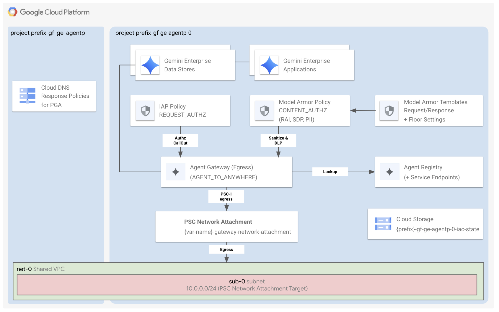

# Gemini Enterprise Agent Platform / Platform Deployment



This stage is part of the `Gemini Enterprise Agent Platform` factory.

It is responsible for deploying the components enabling the Gemini Enterprise Agent Platform inside the service project, created in [0-prereqs](../0-prereqs/README.md) or in an existing project.

It performs the following tasks:

- Deploys or adopts **Gemini Enterprise applications** (`APP_TYPE_INTRANET`) and their **assistants**, binding the Egress Agent Gateway to each app and managing app-level IAM and Antigravity access.
- Registers service endpoints in **Agent Registry** (`var.agent_registry_services`):
  - Custom HTTP/gRPC endpoints, A2A agents, and **Custom MCP servers**.
  - Creates federated **Custom MCP data connectors** in Gemini Enterprise for registered MCP servers (`agent_gateway_app_ids`), routed through the Egress Agent Gateway with optional **OAuth 2.0** authentication backed by Secret Manager.
- Deploys the **Egress Agent Gateway** configured with `AGENT_TO_ANYWHERE` access path.
- Creates a Private Service Connect **(PSC) Network Attachment for Agent Gateway** and attaches it to the Shared VPC.
- Creates the **agent connectivity template** through which the gateway reaches the Shared VPC.
- Configures authorization extensions and safety policies:
  - **Identity-Aware Proxy (IAP)** (`REQUEST_AUTHZ`): enforces identity verification and access control on incoming requests.
  - **Model Armor**: directional safety templates (`user-to-ge`, `ge-to-user`, `agent-gateway-to-external`, `external-to-agent-gateway`) for Gemini Enterprise assistants and Agent Gateway `CONTENT_AUTHZ`, plus optional Vertex AI floor settings.
- Grants the **IAM bindings authorizing agent egress** through IAP toward the registry, the registered services, or both.

## Deploy the stage

If you created your project(s) through [0-prereqs](../0-prereqs/README.md), you should already see a `providers.tf` and a `terraform.auto.tfvars` file in this folder.

```shell
terraform init
terraform apply
```

## Gemini Enterprise Applications

You can define Gemini Enterprise applications using `var.gemini_enterprise_apps`, keyed by engine ID (the app ID shown in the Cloud Console).

Each entry can either create the app (by specifying the `engine` block) or configure the assistant and IAM of an app that already exists:

```hcl
gemini_enterprise_apps = {
  # Console-created app: Terraform manages only its assistant, gateway binding, and IAM.
  "gemini-enterprise-existing" = {}

  # Created by Terraform.
  "gemini-enterprise-finance" = {
    engine = {
      display_name               = "Finance"
      search_tier                = "SEARCH_TIER_ENTERPRISE"
      required_subscription_tier = "SUBSCRIPTION_TIER_SEARCH_AND_ASSISTANT"
      search_add_ons             = ["SEARCH_ADD_ON_LLM"]
    }
  }
}
```

Gemini Enterprise uses a generic Discovery Engine search engine with `app_type` set to `APP_TYPE_INTRANET`, which this stage configures automatically. `data_store_ids` is optional and empty by default; any Custom MCP server data connectors targeting the app via `agent_gateway_app_ids` are attached automatically.

### Importing and Configuring the Default Assistant

Gemini Enterprise creates the `default_assistant` automatically alongside the app, so Terraform adopts it rather than creating a new one (`deletion_policy = "ABANDON"`). Before running `terraform apply` for a new app, import its assistant:

```shell
terraform import 'google_discovery_engine_assistant.default["APP_ID"]' \
  "projects/PROJECT_ID/locations/LOCATION/collections/default_collection/engines/APP_ID/assistants/default_assistant"
```

You can configure the assistant's `generation_config` (`default_language` and `system_instruction`), `banned_phrases`, `web_grounding_type`, and `model_armor` settings inside `gemini_enterprise_apps[*].assistant`:

```hcl
gemini_enterprise_apps = {
  "gemini-enterprise-finance" = {
    assistant = {
      display_name       = "Finance Assistant"
      web_grounding_type = "WEB_GROUNDING_TYPE_GOOGLE_SEARCH"
      banned_phrases = [
        {
          phrase            = "competitor-secret"
          match_type        = "SIMPLE_STRING_MATCH"
          ignore_diacritics = true
        }
      ]
      generation_config = {
        default_language   = "en"
        system_instruction = "You are a helpful finance assistant."
      }
      model_armor = {
        enable       = true
        failure_mode = "FAIL_CLOSED"
      }
    }
    engine = {
      display_name = "Finance"
    }
  }
}
```

### Binding the Egress Agent Gateway to Apps

Because `google_discovery_engine_search_engine` does not yet expose `agentGatewaySetting` in its resource schema, this stage binds the Egress Agent Gateway to every app in `var.gemini_enterprise_apps` through a `local-exec` `PATCH` setting `agentGatewaySetting.defaultEgressAgentGateway.name`. This routes all outbound traffic of those apps through the gateway.

### App IAM and Antigravity Access

Grant access to identities on each app using its `iam` block:

```hcl
gemini_enterprise_apps = {
  "gemini-enterprise-finance" = {
    engine = {
      display_name = "Finance"
    }
    iam = {
      "roles/discoveryengine.agentspaceUser" = [
        "group:finance-team@example.com"
      ]
    }
  }
}
```

By default, app IAM is applied authoritatively (`var.gemini_enterprise_iam.authoritative = true`). Set `gemini_enterprise_iam = { authoritative = false }` to use additive bindings instead.

Every principal granted a role on an app also receives `roles/discoveryengine.agentspaceRestrictedUser` additively at the project level, which users need to interact with apps and their data connectors.

To grant users access to **Antigravity** (`businessaicode.*` permissions at the project level), list them in `var.gemini_enterprise_antigravity_principals`:

```hcl
gemini_enterprise_antigravity_principals = [
  "group:developers@example.com"
]
```

By default, this grants the `projects/PROJECT_ID/roles/discoveryengineUserBusinessAiCodeOnly` custom role created in [0-prereqs](../0-prereqs/README.md). Override it via `var.gemini_enterprise_iam.antigravity_role` if you manage an organization-level custom role instead.

## VPC connectivity

The gateway reaches your Shared VPC through an [agent connectivity template](https://docs.cloud.google.com/gemini-enterprise-agent-platform/govern/gateways/set-up-vpc-connectivity), a resource holding the egress networking settings of the gateway. This stage creates the PSC network attachment and the template that points at it.

The defaults keep every flow inside your network, which is what a VPC-SC perimeter requires: `access_types = ["PRIVATE"]` so the gateway only reaches private destinations, and `vpc_egress = "ALL_TRAFFIC"` so all of its traffic leaves through the attachment rather than only the private ranges.

Relax them, or peer a private DNS zone into the gateway, through `var.agent_gateway_config.egress.networking`:

```hcl
agent_gateway_config = {
  egress = {
    networking = {
      access_types = ["PRIVATE", "PUBLIC"]
      vpc_egress   = "PRIVATE_RANGES_ONLY"
      dns_peering_config = {
        domain = "corp.example.com."
        # Defaults to var.networking_config.vpc
        # target_network = "projects/my-host-project/global/networks/my-vpc"
      }
    }
  }
}
```

> [!NOTE]
> A freshly created gateway takes a short while to become visible to the authorization policy API. If the first `terraform apply` fails because a policy cannot resolve its target, re-run it.

> [!IMPORTANT]
> A connectivity template cannot be changed while a gateway references it: the API answers `cannot update agent connectivity template that is referenced by an agent gateway`. Changing `access_types`, `vpc_egress` or `dns_peering_config` after the first apply therefore needs the gateway detached first, so pick these settings up front.

## Agent Gateway Authorization & Model Armor Policies

By default, the stage configures Agent Gateway with IAP authorization policies.
This allows you to govern how agents (including the ones from Gemini Enterprise apps) access other agents and other resources, such as custom endpoints, Google APIs, and MCP servers.

Optionally, you can enable **Model Armor** on both the **Agent Gateway** and **Gemini Enterprise assistants**. `var.model_armor_templates` defines templates for four interaction directions by default:

- `user-to-ge` and `ge-to-user`: created in `var.location` (with `MODALITY_TEXT` and `MODALITY_IMAGE`) when referenced by a Gemini Enterprise assistant (`assistant.model_armor.enable = true`).
- `agent-gateway-to-external` and `external-to-agent-gateway`: created in `var.region` (with `MODALITY_TEXT`) when referenced by the Agent Gateway (`agent_gateway_config.egress.model_armor_config.enable = true`).

Model Armor is opt-in: **a template is only created if its direction is referenced** by the Agent Gateway or by a Gemini Enterprise assistant. Because `google_model_armor_template` does not yet expose `templateMetadata.modalities` or `templateMetadata.dataResidencyCompliant` in the provider schema, a `local-exec` `PATCH` sets both attributes after each referenced template is created or updated.

You can also enable project-wide Vertex AI floor settings via `var.model_armor_floor_setting`.

```hcl
agent_gateway_config = {
  egress = {
    iap = {
      fail_open = false
    }
    model_armor_config = {
      enable = true
      # Optional: scope to specific host headers
      # authz_hosts = ["example.internal"]
    }
    # Registry attached to the gateway. One of
    # 'eu', 'global', 'regional', 'us'.
    registry_locations = ["regional"]
  }
}

gemini_enterprise_apps = {
  "gemini-enterprise-finance" = {
    assistant = {
      model_armor = {
        enable = true
      }
    }
    engine = {
      display_name = "Finance"
    }
  }
}
```

### Registry locations

An Agent Gateway resolves destination URLs against the Agent Registry instance attached to it. `var.agent_gateway_config.egress.registry_locations` selects that instance by keyword, and each keyword maps to a registry URI:

| Keyword | Registry |
|---|---|
| `eu` | the multi-regional European registry |
| `global` | the global registry |
| `regional` | the regional registry |
| `us` | the multi-regional US registry |

At most one can be attached, and the default is `["regional"]` (Gemini Enterprise apps require their Egress Agent Gateway to be linked to a single Agent Registry).

Registry location and service location are separate settings: `registry_locations` says which registry the gateway reads, while `agent_registry_services[*].location` (which defaults to `var.region`) says where each service is registered. A service is only reachable through the gateway if its location matches the attached registry.

### Policy model

IAP evaluates agent egress against one of two mutually exclusive policy models, selected by `iapPolicyVersion` on the authorization extension. They check different permissions, so a gateway configured for one model ignores the policies of the other.

| | `V1` | `V2` |
|---|---|---|
| Model | IAM allow policies (role bindings) | [IAM Unified Access Policies](https://docs.cloud.google.com/gemini-enterprise-agent-platform/govern/policies/iam-overview-uap) |
| Permission checked | `iap.webServiceVersions.egressViaIAP` | `iap.googleapis.com/resources.egressViaIAP` |
| Granted by | `roles/iap.egressor` on the destination | a rule inside an access policy |

**This stage supports `V1` only**, because the Terraform Google provider cannot yet bind the IAM v3 access policies that `V2` evaluates.

`var.agent_gateway_config.egress.iap.policy_version` defaults to `V1`, and the `agent_registry_iam*` variables described in [Authorizing agent egress](#authorizing-agent-egress) create `roles/iap.egressor` bindings, which only a `V1` gateway evaluates.

`V2` is rejected by a variable validation. Terraform can create an access policy with `google_iam_project_access_policy`, but it cannot bind one to a project: binding requires the `target.resource` field of the IAM v3 API, and `google_iam_projects_policy_binding` exposes only `target.principal_set`. An unbound access policy has no effect, so accepting `V2` here would silently disable every egress guardrail. If you need `V2`, manage the access policies and their bindings outside this stage.

### Enforcement mode

By default, IAP **enforces** the IAM policies described in [Authorizing agent egress](#authorizing-agent-egress): egress that no binding allows is blocked.

Before rolling out policies to live traffic, deploy them in audit-only mode by setting `iam_enforcement_mode` to `DRY_RUN`. In this mode IAP logs the egress it would have denied to Cloud Audit Logs, without blocking it:

```hcl
agent_gateway_config = {
  egress = {
    iap = {
      iam_enforcement_mode = "DRY_RUN"
    }
  }
}
```

Once the audit logs show no unexpected denials, remove the attribute to start enforcing. `DRY_RUN` and `null` (enforce) are the only accepted values.

## Setting Up Custom Services and MCP Data Connectors

You can register your services in Agent Registry, including REST APIs, A2A agents, and MCP servers, by setting `var.agent_registry_services`. `content` accepts either a path to a JSON file or an inline JSON string (`url` is required for `endpoint` and `mcp_server`, and omitted for `agent` where interfaces are defined inside the A2A Agent Card):

```hcl
agent_registry_services = {
  weather = {
    display_name = "Weather API Service"
    description  = "Internal weather forecast service"
    url          = "https://weather.example.com"
    # Optional: 'endpoint' (default), 'agent' or 'mcp_server'
    type = "endpoint"
  }
  fares-agent = {
    display_name = "Fares A2A Agent"
    type         = "agent"
    content      = "specs/fares-agent-card.json"
  }
  weather-mcp = {
    display_name = "Weather MCP Server"
    description  = "Internal weather forecast MCP server"
    url          = "https://weather-mcp.example.com/mcp"
    type         = "mcp_server"
    protocol     = "JSONRPC"
    # Required for 'agent' and 'mcp_server' types (file path or inline JSON)
    content               = "specs/weather-mcp.json"
    agent_gateway_app_ids = ["gemini-enterprise-finance"]
  }
}
```

### Custom MCP Server Data Connectors and OAuth 2.0

For any `mcp_server` entry in `var.agent_registry_services`, listing Gemini Enterprise app IDs in `agent_gateway_app_ids` creates a federated `custom_mcp` Discovery Engine data connector per listed app, routes its traffic through the Egress Agent Gateway, and attaches the resulting data store (`<collection_id>_mcp_data`) to the app's `data_store_ids`.

To configure **OAuth 2.0** on Custom MCP data connectors without storing credentials in plaintext in Terraform state:

1. Create an **OAuth 2.0 Client ID** (Web application) in Google Cloud or your identity provider with `https://vertexaisearch.cloud.google.com/oauth-redirect` configured as an **Authorized redirect URI**.
2. Store the OAuth Client ID and Client Secret as secrets in **Secret Manager** in the service project (the Discovery Engine service agent is already granted `roles/secretmanager.secretAccessor` and `roles/secretmanager.viewer` in [0-prereqs](../0-prereqs/README.md)).
3. Configure `var.oauth_config` (shared default across MCP connectors) or `agent_registry_services[*].oauth_config` (per-service override) using Secret Manager secret version resource names (`projects/PROJECT/secrets/SECRET/versions/VERSION`):

```hcl
oauth_config = {
  auth_uri        = "https://accounts.google.com/o/oauth2/v2/auth"
  auth_uri_params = "&access_type=offline&prompt=consent"
  client_id       = "projects/my-service-project/secrets/mcp-oauth-client-id/versions/1"
  client_secret   = "projects/my-service-project/secrets/mcp-oauth-client-secret/versions/1"
  scopes          = ["openid", "email", "profile"]
  token_uri       = "https://oauth2.googleapis.com/token"
}
```

> [!NOTE]
> When referencing Secret Manager, the `/versions/VERSION` suffix (for example `/versions/1` or `/versions/latest`) is required; omitting `/versions/...` causes Discovery Engine to treat the path as a literal string. Due to a `setUpDataConnectorV2` API validation limitation on `custom_mcp` and Terraform's `map(string)` serialization of `action_params`, Terraform initializes each connector with `auth_type = "NO_AUTH"` and immediately patches `actionConfig` (`auth_type = "OAUTH"`, OAuth parameters, `use_agent_gateway_egress = true`, and `agent_gateway_engine`) via `local-exec`.

## Authorizing agent egress

Registering a service in Agent Registry does not by itself let agents reach it. Agent Gateway checks that the calling agent identity holds the `iap.webServiceVersions.egressViaIAP` permission — granted by `roles/iap.egressor` — on the destination resource. All egress is denied unless a binding allows it, so each destination needs a binding naming the agents allowed to call it.

Agents are identified by their [agent identity](https://docs.cloud.google.com/gemini-enterprise-agent-platform/govern/agent-identity-overview), not by a service account:

- Agent Runtime, Gemini Enterprise and Cloud Run agents use built-in identities, in the form `principal://TRUST_DOMAIN/AGENT_UNIQUE_IDENTIFIER` — for example `principal://agents.global.proj-1234567890.system.id.goog/resources/aiplatform/projects/1234567890/locations/europe-west1/reasoningEngines/support-agent`. The [agent-runtime](../../agent-runtime/README.md) factory returns the identity of the agent it deploys in its `agent_identity` output.
- Custom and external agents use Workload Identity Federation identities, in the form `principal://iam.googleapis.com/projects/PROJECT_NUMBER/locations/global/workloadIdentityPools/POOL_ID/subject/SUBJECT`.

Agent identifiers in URN format (`urn:agent:...`) are used for catalog lookups only and are not valid in IAM bindings.

### Authorizing access to services registered by this stage

Every entry of `var.agent_registry_services` accepts the `iam`, `iam_bindings` and `iam_bindings_additive` attributes, so grants live next to the service they authorize.

For example, you can authorize your agent to call an external endpoint, by granting the `iap.egressor` role:

```hcl
agent_registry_services = {
  billing-api = {
    display_name = "Billing REST API"
    description  = "Internal billing service"
    url          = "https://billing.example.com"
    location     = "europe-west1"
    # Authoritative IAM binding
    iam = {
      "roles/iap.egressor" = [
        "principal://agents.global.proj-1234567890.system.id.goog/resources/aiplatform/projects/1234567890/locations/europe-west1/reasoningEngines/support-agent"
      ]
    }
  }
}
```

That single entry does three things: it registers the API in Agent Registry, it creates `google_iap_agent_registry_endpoint_iam_binding` on the resulting endpoint, and — once the gateway is enforcing — it lets `support-agent` reach `https://billing.example.com` while every other agent is denied.

> [!NOTE]
> IAP identifies a registered service by the id Agent Registry generates for it (`agentregistry-0000...`), not by the service id you choose. The stage resolves that for you: bindings declared on a service, and the `*_id` attributes of the `agent_registry_iam_bindings*` variables, both accept the service id and are translated to the generated one. An id that matches no service registered here is passed through unchanged, which is how you target a resource registered elsewhere.

The same attributes work for MCP servers and agents:

```hcl
agent_registry_services = {
  weather-mcp = {
    display_name = "Weather MCP Server"
    url          = "https://weather-mcp.example.com"
    type         = "mcp_server"
    content      = file("specs/weather-mcp.json")
    # Authoritative IAM binding
    iam = {
      "roles/iap.egressor" = [
        "principal://agents.global.proj-1234567890.system.id.goog/resources/aiplatform/projects/1234567890/locations/europe-west1/reasoningEngines/support-agent"
      ]
    }
  }
}
```

Using `iam_bindings`, you can allow access to specific MCP tools by filtering on the corresponding `iap.googleapis.com/mcp.toolName` attribute.

```hcl
agent_registry_services = {
  # Authoritative IAM binding that allows also to express conditions.
  # This allows allowing access to specific MCP tools.
  weather-mcp-readonly = {
    display_name = "Weather MCP Server (read-only tools)"
    url          = "https://weather-mcp.example.com"
    type         = "mcp_server"
    content      = file("specs/weather-mcp.json")
    iam_bindings = {
      forecast-tool-only = {
        members = [
          "principal://agents.global.proj-1234567890.system.id.goog/resources/aiplatform/projects/1234567890/locations/europe-west1/reasoningEngines/support-agent"
        ]
        role    = "roles/iap.egressor"
        condition = {
          title      = "forecast-tool-only"
          expression = "api.getAttribute('iap.googleapis.com/mcp.toolName', '') in ['get_forecast', '']"
        }
      }
    }
  }
}
```

The `destination.*` attributes documented for [IAM Access policies](https://docs.cloud.google.com/gemini-enterprise-agent-platform/govern/policies/cel-attributes-uap) belong to the `V2` policy model and do not apply here.

### Authorizing access to the whole registry and to external services

Use the `var.agent_registry_iam*` variables to grant egress across the whole registry, or toward resources that this stage does not register.

```hcl
# Whole registry, in {ROLE => [MEMBERS]} format.
agent_registry_iam = {
  "roles/iap.egressor" = [
    "principal://agents.global.proj-1234567890.system.id.goog/resources/aiplatform/projects/1234567890/locations/europe-west1/reasoningEngines/support-agent"
  ]
}

# Whole registry, in {PRINCIPAL => [ROLES]} format.
agent_registry_iam_by_principals = {
  "principalSet://goog/group/agent-platform@example.com" = [
    "roles/iap.egressor"
  ]
}

# A single service registered outside this stage. Set at most one of
# 'agent_id', 'endpoint_id' or 'mcp_server_id' to narrow the binding
# down from the whole registry.
agent_registry_iam_bindings = {
  support-to-partner = {
    members = [
      "principal://agents.global.proj-1234567890.system.id.goog/resources/aiplatform/projects/1234567890/locations/europe-west1/reasoningEngines/support-agent"
    ]
    role     = "roles/iap.egressor"
    agent_id = "partner-agent"
    # Defaults to var.region
    location = "global"
  }
}

# Additive: leaves members granted outside Terraform untouched.
agent_registry_iam_bindings_additive = {
  support-to-legacy-mcp = {
    member        = "principal://agents.global.proj-1234567890.system.id.goog/resources/aiplatform/projects/1234567890/locations/europe-west1/reasoningEngines/support-agent"
    role          = "roles/iap.egressor"
    mcp_server_id = "legacy-mcp"
  }
}
```

> [!NOTE]
> Destinations that are not registered in Agent Registry cannot be targeted by these bindings, since a binding needs a registry resource to attach to. Controlling egress toward unregistered hosts and paths requires the `V2` policy model, which this stage does not support — see [Policy model](#policy-model).

## Manage prerequisites independently

The [0-prereqs stage](../0-prereqs/README.md) generates the necessary Terraform input files for this stage. If you manage prerequisites independently (without the [0-prereqs stage](../0-prereqs/README.md)), you'll need to manually set values for your variables in a `terraform.tfvars` file (by following what is defined in [variables.tf](./variables.tf)), and provide a `providers.tf` file.

You can look at the template files ([1](../0-prereqs/templates/providers.tf.tpl), [2](../0-prereqs/templates/terraform.auto.tfvars.tpl)) and the [outputs.tf](../0-prereqs/outputs.tf) of the [0-prereqs](../0-prereqs/README.md) stage for more details about the structure of these files.

### Working with Fabric FAST

This stage is fully compatible with the latest tagged version of [Fabric FAST](https://github.com/GoogleCloudPlatform/cloud-foundation-fabric/tree/master/fast).
You can create your host project and network resources using your FAST networking stage, and your service project using your own FAST project factory.
<!-- BEGIN TFDOC -->
## Variables

| name | description | type | required | default |
|---|---|:---:|:---:|:---:|
| [networking_config](variables.tf#L651) | The networking configuration. Each element is either the id of the resource or the key of the map var.vpc_self_links. | <code title="object&#40;&#123;&#10;  subnet &#61; string&#10;  vpc    &#61; string&#10;&#125;&#41;">object&#40;&#123;&#8230;&#125;&#41;</code> | ✓ |  |
| [number](variables.tf#L660) | The number of the project where to create the resources. Agent Gateways reference their connectivity template by project number. | <code>string</code> | ✓ |  |
| [project_id](variables.tf#L711) | The id of the project where to create the resources. | <code>string</code> | ✓ |  |
| [agent_gateway_config](variables.tf#L15) | Agent Gateway configuration including VPC connectivity and authorization extensions. | <code title="object&#40;&#123;&#10;  egress &#61; optional&#40;object&#40;&#123;&#10;    iap &#61; optional&#40;object&#40;&#123;&#10;      fail_open &#61; optional&#40;bool, true&#41;&#10;      iam_enforcement_mode &#61; optional&#40;string&#41;&#10;      policy_version &#61; optional&#40;string, &#34;V1&#34;&#41;&#10;      timeout        &#61; optional&#40;string, &#34;2s&#34;&#41;&#10;    &#125;&#41;, &#123;&#125;&#41;&#10;    model_armor_config &#61; optional&#40;object&#40;&#123;&#10;      authz_hosts        &#61; optional&#40;list&#40;string&#41;, &#91;&#93;&#41;&#10;      enable             &#61; optional&#40;bool, false&#41;&#10;      fail_open          &#61; optional&#40;bool, false&#41;&#10;      request_direction  &#61; optional&#40;string, &#34;agent-gateway-to-external&#34;&#41;&#10;      response_direction &#61; optional&#40;string, &#34;external-to-agent-gateway&#34;&#41;&#10;      timeout            &#61; optional&#40;string, &#34;2s&#34;&#41;&#10;    &#125;&#41;, &#123;&#125;&#41;&#10;    networking &#61; optional&#40;object&#40;&#123;&#10;      access_types &#61; optional&#40;list&#40;string&#41;, &#91;&#34;PRIVATE&#34;&#93;&#41;&#10;      dns_peering_config &#61; optional&#40;object&#40;&#123;&#10;        domain &#61; string&#10;        target_network &#61; optional&#40;string&#41;&#10;      &#125;&#41;&#41;&#10;      vpc_egress &#61; optional&#40;string, &#34;ALL_TRAFFIC&#34;&#41;&#10;    &#125;&#41;, &#123;&#125;&#41;&#10;    registry_locations &#61; optional&#40;list&#40;string&#41;, &#91;&#34;regional&#34;&#93;&#41;&#10;  &#125;&#41;, &#123;&#125;&#41;&#10;&#125;&#41;">object&#40;&#123;&#8230;&#125;&#41;</code> |  | <code>&#123;&#125;</code> |
| [agent_registry_iam](variables.tf#L123) | Agent Registry IAM bindings in {ROLE => [MEMBERS]} format. | <code>map&#40;list&#40;string&#41;&#41;</code> |  | <code>&#123;&#125;</code> |
| [agent_registry_iam_bindings](variables.tf#L130) | Authoritative Agent Registry IAM bindings in {KEY => {role = ROLE, members = [], condition = {}}} format. Set at most one of the '*_id' attributes to scope the binding to a single registry resource, or none to target the whole registry. Location defaults to var.region. Keys are arbitrary. | <code title="map&#40;object&#40;&#123;&#10;  members       &#61; list&#40;string&#41;&#10;  role          &#61; string&#10;  agent_id      &#61; optional&#40;string&#41;&#10;  endpoint_id   &#61; optional&#40;string&#41;&#10;  location      &#61; optional&#40;string&#41;&#10;  mcp_server_id &#61; optional&#40;string&#41;&#10;  condition &#61; optional&#40;object&#40;&#123;&#10;    expression  &#61; string&#10;    title       &#61; string&#10;    description &#61; optional&#40;string&#41;&#10;  &#125;&#41;&#41;&#10;&#125;&#41;&#41;">map&#40;object&#40;&#123;&#8230;&#125;&#41;&#41;</code> |  | <code>&#123;&#125;</code> |
| [agent_registry_iam_bindings_additive](variables.tf#L156) | Additive Agent Registry IAM bindings. Set at most one of the '*_id' attributes to scope the binding to a single registry resource, or none to target the whole registry. Location defaults to var.region. Keys are arbitrary. | <code title="map&#40;object&#40;&#123;&#10;  member        &#61; string&#10;  role          &#61; string&#10;  agent_id      &#61; optional&#40;string&#41;&#10;  endpoint_id   &#61; optional&#40;string&#41;&#10;  location      &#61; optional&#40;string&#41;&#10;  mcp_server_id &#61; optional&#40;string&#41;&#10;  condition &#61; optional&#40;object&#40;&#123;&#10;    expression  &#61; string&#10;    title       &#61; string&#10;    description &#61; optional&#40;string&#41;&#10;  &#125;&#41;&#41;&#10;&#125;&#41;&#41;">map&#40;object&#40;&#123;&#8230;&#125;&#41;&#41;</code> |  | <code>&#123;&#125;</code> |
| [agent_registry_iam_by_principals](variables.tf#L182) | Authoritative Agent Registry IAM bindings in {PRINCIPAL => [ROLES]} format. Principals need to be statically defined to avoid errors. Merged internally with the 'agent_registry_iam' variable. | <code>map&#40;list&#40;string&#41;&#41;</code> |  | <code>&#123;&#125;</code> |
| [agent_registry_services](variables.tf#L189) | Custom service endpoints to register in Agent Registry, keyed by service id. | <code title="map&#40;object&#40;&#123;&#10;  agent_gateway_app_ids &#61; optional&#40;list&#40;string&#41;, &#91;&#93;&#41;&#10;  content               &#61; optional&#40;string&#41;&#10;  description           &#61; optional&#40;string&#41;&#10;  display_name          &#61; optional&#40;string&#41;&#10;  iam                   &#61; optional&#40;map&#40;list&#40;string&#41;&#41;, &#123;&#125;&#41;&#10;  iam_bindings &#61; optional&#40;map&#40;object&#40;&#123;&#10;    members &#61; list&#40;string&#41;&#10;    role    &#61; string&#10;    condition &#61; optional&#40;object&#40;&#123;&#10;      expression  &#61; string&#10;      title       &#61; string&#10;      description &#61; optional&#40;string&#41;&#10;    &#125;&#41;&#41;&#10;  &#125;&#41;&#41;, &#123;&#125;&#41;&#10;  iam_bindings_additive &#61; optional&#40;map&#40;object&#40;&#123;&#10;    member &#61; string&#10;    role   &#61; string&#10;    condition &#61; optional&#40;object&#40;&#123;&#10;      expression  &#61; string&#10;      title       &#61; string&#10;      description &#61; optional&#40;string&#41;&#10;    &#125;&#41;&#41;&#10;  &#125;&#41;&#41;, &#123;&#125;&#41;&#10;  location &#61; optional&#40;string&#41;&#10;  oauth_config &#61; optional&#40;object&#40;&#123;&#10;    auth_uri &#61; string&#10;    client_id       &#61; string&#10;    token_uri       &#61; string&#10;    auth_uri_params &#61; optional&#40;string&#41;&#10;    client_secret                &#61; optional&#40;string&#41;&#10;    client_secret_basic_override &#61; optional&#40;bool, true&#41;&#10;    pkce_support_enabled         &#61; optional&#40;bool, true&#41;&#10;    scopes                       &#61; optional&#40;list&#40;string&#41;, &#91;&#93;&#41;&#10;  &#125;&#41;&#41;&#10;  protocol &#61; optional&#40;string, &#34;HTTP_JSON&#34;&#41;&#10;  type     &#61; optional&#40;string, &#34;endpoint&#34;&#41;&#10;  url      &#61; optional&#40;string&#41;&#10;&#125;&#41;&#41;">map&#40;object&#40;&#123;&#8230;&#125;&#41;&#41;</code> |  | <code>&#123;&#125;</code> |
| [enable_deletion_protection](variables.tf#L299) | Whether deletion protection is enabled. | <code>bool</code> |  | <code>true</code> |
| [gemini_enterprise_antigravity_principals](variables.tf#L306) | The principals that also get Antigravity. Granted additively at project level with the custom role. | <code>list&#40;string&#41;</code> |  | <code>&#91;&#93;</code> |
| [gemini_enterprise_apps](variables.tf#L322) | The Gemini Enterprise apps, keyed by engine id. | <code title="map&#40;object&#40;&#123;&#10;  assistant &#61; optional&#40;object&#40;&#123;&#10;    assistant_id &#61; optional&#40;string, &#34;default_assistant&#34;&#41;&#10;    banned_phrases &#61; optional&#40;list&#40;object&#40;&#123;&#10;      phrase            &#61; string&#10;      ignore_diacritics &#61; optional&#40;bool&#41;&#10;      match_type        &#61; optional&#40;string&#41;&#10;    &#125;&#41;&#41;, &#91;&#93;&#41;&#10;    description  &#61; optional&#40;string&#41;&#10;    display_name &#61; optional&#40;string, &#34;Default Assistant&#34;&#41;&#10;    generation_config &#61; optional&#40;object&#40;&#123;&#10;      default_language   &#61; optional&#40;string&#41;&#10;      system_instruction &#61; optional&#40;string&#41;&#10;    &#125;&#41;&#41;&#10;    model_armor &#61; optional&#40;object&#40;&#123;&#10;      enable                &#61; optional&#40;bool, false&#41;&#10;      failure_mode          &#61; optional&#40;string, &#34;FAIL_CLOSED&#34;&#41;&#10;      response_direction    &#61; optional&#40;string, &#34;ge-to-user&#34;&#41;&#10;      user_prompt_direction &#61; optional&#40;string, &#34;user-to-ge&#34;&#41;&#10;    &#125;&#41;, &#123;&#125;&#41;&#10;    web_grounding_type &#61; optional&#40;string&#41;&#10;  &#125;&#41;, &#123;&#125;&#41;&#10;  collection_id &#61; optional&#40;string, &#34;default_collection&#34;&#41;&#10;  engine &#61; optional&#40;object&#40;&#123;&#10;    display_name      &#61; string&#10;    company_name      &#61; optional&#40;string&#41;&#10;    data_store_ids    &#61; optional&#40;list&#40;string&#41;, &#91;&#93;&#41;&#10;    disable_analytics &#61; optional&#40;bool&#41;&#10;    features          &#61; optional&#40;map&#40;string&#41;, &#123;&#125;&#41;&#10;    industry_vertical &#61; optional&#40;string, &#34;GENERIC&#34;&#41;&#10;    knowledge_graph &#61; optional&#40;object&#40;&#123;&#10;      cloud_knowledge_graph_types    &#61; optional&#40;list&#40;string&#41;, &#91;&#93;&#41;&#10;      enable_cloud_knowledge_graph   &#61; optional&#40;bool, false&#41;&#10;      enable_private_knowledge_graph &#61; optional&#40;bool, false&#41;&#10;      feature_config &#61; optional&#40;object&#40;&#123;&#10;        disable_private_kg_auto_complete       &#61; optional&#40;bool&#41;&#10;        disable_private_kg_enrichment          &#61; optional&#40;bool&#41;&#10;        disable_private_kg_query_ui_chips      &#61; optional&#40;bool&#41;&#10;        disable_private_kg_query_understanding &#61; optional&#40;bool&#41;&#10;      &#125;&#41;&#41;&#10;    &#125;&#41;, &#123;&#125;&#41;&#10;    required_subscription_tier &#61; optional&#40;string&#41;&#10;    search_add_ons             &#61; optional&#40;list&#40;string&#41;&#41;&#10;    search_tier                &#61; optional&#40;string&#41;&#10;  &#125;&#41;&#41;&#10;  iam &#61; optional&#40;map&#40;list&#40;string&#41;&#41;, &#123;&#125;&#41;&#10;&#125;&#41;&#41;">map&#40;object&#40;&#123;&#8230;&#125;&#41;&#41;</code> |  | <code>&#123;&#125;</code> |
| [gemini_enterprise_iam](variables.tf#L445) | How app IAM is applied. | <code title="object&#40;&#123;&#10;  antigravity_role &#61; optional&#40;string&#41;&#10;  authoritative    &#61; optional&#40;bool, true&#41;&#10;&#125;&#41;">object&#40;&#123;&#8230;&#125;&#41;</code> |  | <code>&#123;&#125;</code> |
| [location](variables.tf#L464) | The location of the Gemini Enterprise resources. Components that address the app must match the location of the app itself. | <code>string</code> |  | <code>&#34;eu&#34;</code> |
| [model_armor_floor_setting](variables.tf#L476) | The Model Armor floor setting configuration for Vertex AI. | <code title="object&#40;&#123;&#10;  enabled          &#61; optional&#40;bool, false&#41;&#10;  enforcement_type &#61; optional&#40;string, &#34;INSPECT_AND_BLOCK&#34;&#41;&#10;  logging          &#61; optional&#40;bool, true&#41;&#10;  malicious_uri &#61; optional&#40;object&#40;&#123;&#10;    enabled &#61; optional&#40;string, &#34;ENABLED&#34;&#41;&#10;  &#125;&#41;, &#123;&#125;&#41;&#10;  pi_and_jailbreak &#61; optional&#40;object&#40;&#123;&#10;    confidence_level &#61; optional&#40;string, &#34;HIGH&#34;&#41;&#10;    enabled          &#61; optional&#40;string, &#34;ENABLED&#34;&#41;&#10;  &#125;&#41;, &#123;&#125;&#41;&#10;  rai_filters &#61; optional&#40;object&#40;&#123;&#10;    DANGEROUS         &#61; optional&#40;string, &#34;HIGH&#34;&#41;&#10;    HARASSMENT        &#61; optional&#40;string, &#34;HIGH&#34;&#41;&#10;    HATE_SPEECH       &#61; optional&#40;string, &#34;HIGH&#34;&#41;&#10;    SEXUALLY_EXPLICIT &#61; optional&#40;string, &#34;HIGH&#34;&#41;&#10;  &#125;&#41;, &#123;&#125;&#41;&#10;  sdp &#61; optional&#40;object&#40;&#123;&#10;    enabled &#61; optional&#40;string, &#34;ENABLED&#34;&#41;&#10;  &#125;&#41;, &#123;&#125;&#41;&#10;&#125;&#41;">object&#40;&#123;&#8230;&#125;&#41;</code> |  | <code>&#123;&#125;</code> |
| [model_armor_template_prefix](variables.tf#L555) | An optional prefix prepended to every Model Armor template id. | <code>string</code> |  | <code>&#34;&#34;</code> |
| [model_armor_templates](variables.tf#L562) | The Model Armor templates, keyed by interaction direction. Only templates referenced by the Agent Gateway or a Gemini Enterprise assistant are created. | <code title="map&#40;object&#40;&#123;&#10;  custom_llm_response_safety_error_code    &#61; optional&#40;number, 401&#41;&#10;  custom_llm_response_safety_error_message &#61; optional&#40;string, &#34;This is a custom error message for LLM response&#34;&#41;&#10;  custom_prompt_safety_error_code          &#61; optional&#40;number, 400&#41;&#10;  custom_prompt_safety_error_message       &#61; optional&#40;string, &#34;This is a custom error message for prompt&#34;&#41;&#10;  enforcement_type                         &#61; optional&#40;string, &#34;INSPECT_AND_BLOCK&#34;&#41;&#10;  ignore_partial_invocation_failures       &#61; optional&#40;bool, false&#41;&#10;  logging                                  &#61; optional&#40;bool, true&#41;&#10;  malicious_uri &#61; optional&#40;object&#40;&#123;&#10;    enabled &#61; optional&#40;string, &#34;ENABLED&#34;&#41;&#10;  &#125;&#41;, &#123;&#125;&#41;&#10;  modalities &#61; optional&#40;list&#40;string&#41;, &#91;&#34;MODALITY_TEXT&#34;, &#34;MODALITY_IMAGE&#34;&#93;&#41;&#10;  pi_and_jailbreak &#61; optional&#40;object&#40;&#123;&#10;    confidence_level &#61; optional&#40;string, &#34;MEDIUM_AND_ABOVE&#34;&#41;&#10;    enabled          &#61; optional&#40;string, &#34;ENABLED&#34;&#41;&#10;  &#125;&#41;, &#123;&#125;&#41;&#10;  rai_filters &#61; optional&#40;object&#40;&#123;&#10;    DANGEROUS         &#61; optional&#40;string, &#34;LOW_AND_ABOVE&#34;&#41;&#10;    HARASSMENT        &#61; optional&#40;string, &#34;LOW_AND_ABOVE&#34;&#41;&#10;    HATE_SPEECH       &#61; optional&#40;string, &#34;LOW_AND_ABOVE&#34;&#41;&#10;    SEXUALLY_EXPLICIT &#61; optional&#40;string, &#34;LOW_AND_ABOVE&#34;&#41;&#10;  &#125;&#41;, &#123;&#125;&#41;&#10;  sdp &#61; optional&#40;object&#40;&#123;&#10;    enabled &#61; optional&#40;string, &#34;ENABLED&#34;&#41;&#10;  &#125;&#41;, &#123;&#125;&#41;&#10;&#125;&#41;&#41;">map&#40;object&#40;&#123;&#8230;&#125;&#41;&#41;</code> |  | <code title="&#123;&#10;  &#34;user-to-ge&#34; &#61; &#123;&#125;&#10;  &#34;ge-to-user&#34; &#61; &#123;&#125;&#10;  &#34;agent-gateway-to-external&#34; &#61; &#123; modalities &#61; &#91;&#34;MODALITY_TEXT&#34;&#93; &#125;&#10;  &#34;external-to-agent-gateway&#34; &#61; &#123; modalities &#61; &#91;&#34;MODALITY_TEXT&#34;&#93; &#125;&#10;&#125;">&#123;&#8230;&#125;</code> |
| [name](variables.tf#L644) | The name of the resources. | <code>string</code> |  | <code>&#34;geap&#34;</code> |
| [oauth_config](variables.tf#L666) | Default OAuth 2.0 configuration for custom MCP server data connectors. Can be overridden per service via agent_registry_services[*].oauth_config. | <code title="object&#40;&#123;&#10;  auth_uri &#61; string&#10;  client_id       &#61; string&#10;  token_uri       &#61; string&#10;  auth_uri_params &#61; optional&#40;string&#41;&#10;  client_secret                &#61; optional&#40;string&#41;&#10;  client_secret_basic_override &#61; optional&#40;bool, true&#41;&#10;  pkce_support_enabled         &#61; optional&#40;bool, true&#41;&#10;  scopes                       &#61; optional&#40;list&#40;string&#41;, &#91;&#93;&#41;&#10;&#125;&#41;">object&#40;&#123;&#8230;&#125;&#41;</code> |  | <code>null</code> |
| [region](variables.tf#L717) | The GCP region where to deploy the resources. | <code>string</code> |  | <code>&#34;europe-west1&#34;</code> |
| [subnet_self_links](variables-fast.tf#L15) | Shared VPCs subnet IDs. | <code>map&#40;string&#41;</code> |  | <code>&#123;&#125;</code> |
| [vpc_self_links](variables-fast.tf#L23) | Shared VPC name => self link mappings. | <code>map&#40;string&#41;</code> |  | <code>&#123;&#125;</code> |

## Outputs

| name | description | sensitive |
|---|---|:---:|
| [agent_connectivity_template_ids](outputs.tf#L15) | The ids of the agent connectivity templates through which the gateways reach the VPC. |  |
| [agent_gateway_ids](outputs.tf#L22) | The Agent Gateway ids. Pass them to the agent-runtime factory to govern the traffic of an agent. |  |
| [agent_registry_service_names](outputs.tf#L29) | The resource names of the services registered in Agent Registry, keyed by service id. |  |
| [agent_registry_uris](outputs.tf#L37) | The Agent Registry URIs. |  |
| [gemini_enterprise_antigravity_principals](outputs.tf#L42) | The principals holding the Antigravity custom role on the project. |  |
| [gemini_enterprise_app_names](outputs.tf#L47) | The resource names of the Gemini Enterprise apps Terraform creates, keyed by engine id. Apps that already existed are not listed. |  |
| [gemini_enterprise_assistant_names](outputs.tf#L55) | The resource names of the managed assistants, keyed by engine id. |  |
| [gemini_enterprise_data_connector_names](outputs.tf#L63) | The resource names of the Gemini Enterprise data connectors, keyed by connector id and app id. |  |
| [model_armor_template_names](outputs.tf#L74) | The resource names of the Model Armor templates, keyed by interaction direction. |  |
<!-- END TFDOC -->
