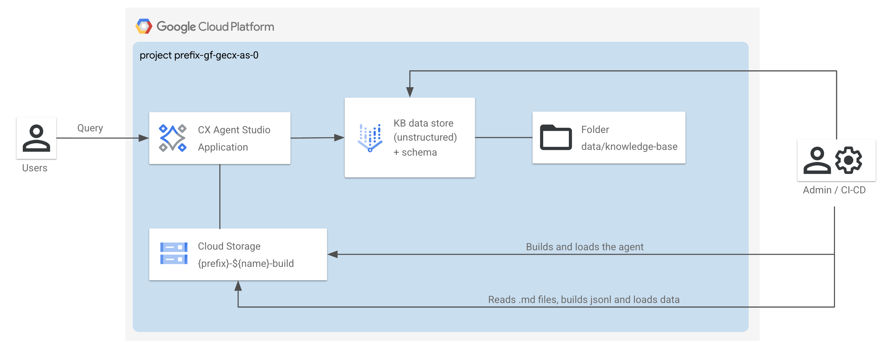

# Conversational Agents - Gemini Enterprise for Customer Experience (GECX) Agent Studio (gecx-as) / Platform Deployment

This stage is part of the `Conversational Agents - Gemini Enterprise for Customer Experience (GECX) Agent Studio (gecx-as)`.
It is responsible for deploying the components enabling the AI use case, either in the project you created in [0-projects](../0-projects) or in an existing project.



## Deploy the stage

This assumes you have created a project leveraging the [0-projects](../0-projects) stage.

```shell
terraform init
terraform apply

# Follow the commands at screen to:
# - Push some sample data to the ds GCS bucket and load it into the data stores
# - Build the agent and push it to CX Agent Studio
# - Query the agent
```

## I have not used 0-projects

The [0-projects](../0-projects) stage generates the necessary Terraform input files for this stage. If you're not using the [0-projects stage](../0-projects), you'll need to manually add the required variables to your `terraform.tfvars` file, as defined in [variables.tf](./variables.tf).

## Manage agent variants

- A copy of your (default variant) agent configuration is available in the `data/agents` folder.
- After you apply `1-apps`, you'll see commands build the agent and push it to CX Agent Studio.
- You can define more agent variants by creating your configuration directory in `data/agents` and updating the Terraform variable `agent_configs.variant`. Output commands to build the agent will be automatically updated.

## Pull remote agents

You can pull remote copies of your agent variants into your `data/agents` directory by using this command:

```shell
uv run scripts/agentutil.py pull_agent {AGENT_REMOTE} data/agents/{AGENT_VARIANT}
```
<!-- BEGIN TFDOC -->
## Variables

| name | description | type | required | default |
|---|---|:---:|:---:|:---:|
| [prefix](variables.tf#L51) | The unique name prefix to be used for all global unique resources. | <code>string</code> | ✓ |  |
| [project_config](variables.tf#L57) | The project where to create the resources. | <code title="object&#40;&#123;&#10;  id     &#61; string&#10;  number &#61; string&#10;&#125;&#41;">object&#40;&#123;&#8230;&#125;&#41;</code> | ✓ |  |
| [agent_configs](variables.tf#L15) | The CX Agent Studio application configurations. | <code title="object&#40;&#123;&#10;  language &#61; optional&#40;string, &#34;en&#34;&#41;&#10;  variant  &#61; optional&#40;string, &#34;default&#34;&#41;&#10;&#125;&#41;">object&#40;&#123;&#8230;&#125;&#41;</code> |  | <code>&#123;&#125;</code> |
| [enable_deletion_protection](variables.tf#L25) | Whether deletion protection should be enabled. | <code>bool</code> |  | <code>true</code> |
| [gecx_as_configs](variables.tf#L32) | The ge4cx-as configurations. | <code title="object&#40;&#123;&#10;  enable_cloud_logging &#61; optional&#40;bool, true&#41;&#10;  speaking_rate        &#61; optional&#40;number, 0&#41;&#10;  supported_languages  &#61; optional&#40;list&#40;string&#41;, &#91;&#34;en-US&#34;&#93;&#41;&#10;  timezone             &#61; optional&#40;string, &#34;Europe&#47;Rome&#34;&#41;&#10;&#125;&#41;">object&#40;&#123;&#8230;&#125;&#41;</code> |  | <code>&#123;&#125;</code> |
| [name](variables.tf#L44) | The name of the resources. | <code>string</code> |  | <code>&#34;gf-gecx-as-0&#34;</code> |
| [region](variables.tf#L66) | The GCP region where to deploy the resources. | <code>string</code> |  | <code>&#34;europe-west1&#34;</code> |
| [region_ai_applications](variables.tf#L73) | The GCP region where to deploy the data store and CX Agent Studio App. | <code>string</code> |  | <code>&#34;eu&#34;</code> |
| [service_accounts](variables.tf#L86) | The pre-created service accounts used by the blueprint. | <code title="map&#40;object&#40;&#123;&#10;  email     &#61; string&#10;  iam_email &#61; string&#10;  id        &#61; string&#10;&#125;&#41;&#41;">map&#40;object&#40;&#123;&#8230;&#125;&#41;&#41;</code> |  | <code>&#123;&#125;</code> |

## Outputs

| name | description | sensitive |
|---|---|:---:|
| [commands](outputs.tf#L15) | Run the following commands when the deployment completes to update and mange the application. |  |
<!-- END TFDOC -->
