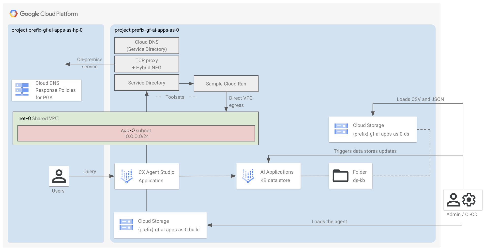

# Gemini Enterprise for Customer Experience (GECX) - CX Agent Studio

This factory automates the deployment of a [CX Agent Studio](https://cloud.google.com/products/gemini-enterprise-for-customer-experience/agent-studio) application connected to an unstructured [data store](https://docs.cloud.google.com/customer-engagement-ai/conversational-agents/ps/tool/data-store), backed by a [Google Cloud Storage (GCS)](https://cloud.google.com/storage/docs/introduction) bucket.

## Core Components

The deployment includes:

- A **CX Agent Studio** application: the conversational agent builder.
- An unstructured **data store** that indexes and serves content to the agent.
- A **GCS bucket** that stores and loads the agent configuration and the source files for the data store ingestion.

**Cloud Run**
- A sample **Cloud Run** instance, configured to be accessed privately and configured with direct VPC egress. CX AS accesses Cloud Run as a toolset (in the gui, tool) via Service Directory.

**Private on-premise connectivity via Service Directory and Proxy LB**
- **Service Directory** that implements [Private Network Access](https://docs.cloud.google.com/service-directory/docs/private-network-access-overview) and by default we configured to connect to an Internal TCP Proxy Load Balancer (next item in this list). You can customize the namespaces and the endpoints configurations through the service directory variable.
- **Internal TCP Proxy LB** that privately connects to a private IP on-premises via hybrid NEGs. The blueprint uses one random private IP that users can customize. You can optionally decide to do not create the LB at all customizing the service directory variable.

- By default, a **host project**, a **shared VPC**, a subnet, private Google APIs routes and DNS policies. Optionally, you can use your own host project and shared VPCs.

- A **service project** with all the necessary APIs, service accounts, permissions set.- All the **underlying network resources**: a VPC, a subnet, a firewall policy rule for Service Directory, Private Google APIs routes and DNS response policies. Optionally, this can be your (shared) VPC.

## Apply the factory

- Navigate to the [0-prereqs](0-prereqs/README.md). Follow the instructions to provision the GCP project, configure required APIs, and set up Service Accounts with the necessary IAM permissions.
- Navigate to the [1-apps](1-apps/README.md). Follow the instructions to deploy the above-mentioned components.
- Follow the commands at screen.
