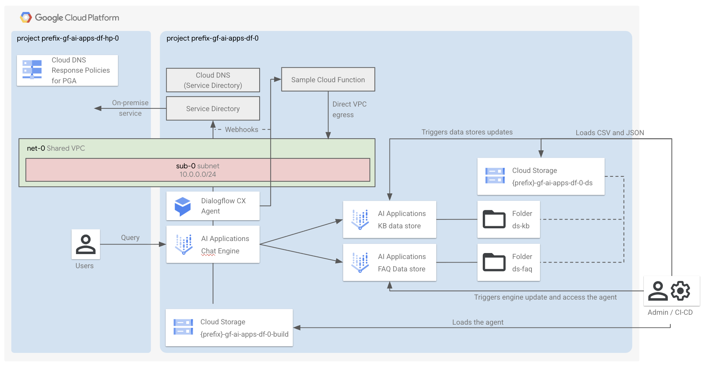

# Gemini Enterprise for Customer Experience (GECX) - Dialogflow CX / Platform Deployment

This stage is part of the `AI Applications - Conversational Agents (Dialogflow)`.
It is responsible for deploying the components enabling the AI use case, either in the project you created in [0-projects](../0-projects) or in an existing project.



## Deploy the stage

This assumes you have created a project leveraging the [0-projects](../0-projects) stage.

```shell
terraform init
terraform apply

# Follow the commands at screen to:
# - Push some sample data to the ds GCS bucket and load it into the data stores
# - Build the agent and push it to the chat engine (Dialogflow CX)
# - Query the agent
```

## I have not used 0-projects

The [0-projects](../0-projects) stage generates the necessary Terraform input files for this stage. If you're not using the [0-projects stage](../0-projects), you'll need to manually add the required variables to your `terraform.tfvars` file, as defined in [variables.tf](./variables.tf).

## Manage agent variants

- A copy of your (default variant) agent configuration is available in the `data/agents` folder.
- After you apply `1-apps`, you'll see commands build the agent and push it to Dialogflow CX.
- You can define more agent variants by creating your configuration directory in `data/agents` and updating the Terraform variable `agent_configs.variant`. Output commands to build the agent will be automatically updated.

## Pull remote agents

You can pull remote copies of your agent variants into your `data/agents` directory by using this command:

```shell
uv run scripts/agentutil/agentutil.py pull_agent {AGENT_REMOTE} data/agents/{AGENT_VARIANT}
```

You can see the full list of commands available in agentutil.py [here](./scripts/agentutil/README.md).
<!-- BEGIN TFDOC -->
## Variables

| name | description | type | required | default |
|---|---|:---:|:---:|:---:|
| [project_config](variables.tf#L75) | The project where to create the resources. | <code title="object&#40;&#123;&#10;  id     &#61; string&#10;  number &#61; string&#10;  prefix &#61; string&#10;&#125;&#41;">object&#40;&#123;&#8230;&#125;&#41;</code> | ✓ |  |
| [agent_configs](variables.tf#L15) | The Dialogflow agent configurations. | <code title="object&#40;&#123;&#10;  language &#61; optional&#40;string, &#34;en&#34;&#41;&#10;  variant  &#61; optional&#40;string, &#34;default&#34;&#41;&#10;&#125;&#41;">object&#40;&#123;&#8230;&#125;&#41;</code> |  | <code>&#123;&#125;</code> |
| [bucket_name](variables.tf#L25) | The name for all GCS buckets added after the prefix. If not specified, var.name is used instead. | <code>string</code> |  | <code>null</code> |
| [cloud_function_config](variables.tf#L31) | The configuration of an optional Cloud Function to reach via Service Directory. | <code title="object&#40;&#123;&#10;  bundle_path            &#61; optional&#40;string, &#34;data&#47;function&#34;&#41;&#10;  direct_vpc_egress_mode &#61; optional&#40;string, &#34;VPC_EGRESS_ALL_TRAFFIC&#34;&#41;&#10;  direct_vpc_egress_tags &#61; optional&#40;list&#40;string&#41;, &#91;&#93;&#41;&#10;  service_invokers       &#61; optional&#40;list&#40;string&#41;, &#91;&#93;&#41;&#10;&#125;&#41;">object&#40;&#123;&#8230;&#125;&#41;</code> |  | <code>&#123;&#125;</code> |
| [enable_deletion_protection](variables.tf#L43) | Whether deletion protection should be enabled. | <code>bool</code> |  | <code>true</code> |
| [name](variables.tf#L50) | The name of the resources. | <code>string</code> |  | <code>&#34;gf-gecx-df-0&#34;</code> |
| [networking_config](variables.tf#L57) | The networking configuration. | <code title="object&#40;&#123;&#10;  create &#61; optional&#40;bool, true&#41;&#10;  vpc_id &#61; optional&#40;string, &#34;net-0&#34;&#41;&#10;  subnet &#61; optional&#40;object&#40;&#123;&#10;    ip_cidr_range &#61; optional&#40;string, &#34;10.0.0.0&#47;24&#34;&#41;&#10;    name          &#61; optional&#40;string, &#34;sub-0&#34;&#41;&#10;  &#125;&#41;, &#123;&#125;&#41;&#10;  subnet_proxy_only &#61; optional&#40;object&#40;&#123;&#10;    ip_cidr_range &#61; optional&#40;string, &#34;10.20.0.0&#47;24&#34;&#41;&#10;    name          &#61; optional&#40;string, &#34;proxy-only-sub-0&#34;&#41;&#10;  &#125;&#41;, &#123;&#125;&#41;&#10;&#125;&#41;">object&#40;&#123;&#8230;&#125;&#41;</code> |  | <code>&#123;&#125;</code> |
| [regions](variables.tf#L85) | The GCP region where to deploy the Dialogflow agents. | <code title="object&#40;&#123;&#10;  agent      &#61; optional&#40;string, &#34;europe-west1&#34;&#41;&#10;  datastores &#61; optional&#40;string, &#34;eu&#34;&#41;&#10;  engine     &#61; optional&#40;string, &#34;eu&#34;&#41;&#10;  resources  &#61; optional&#40;string, &#34;europe-west1&#34;&#41;&#10;&#125;&#41;">object&#40;&#123;&#8230;&#125;&#41;</code> |  | <code>&#123;&#125;</code> |
| [service_accounts](variables.tf#L97) | The pre-created service accounts used by the blueprint. | <code title="map&#40;object&#40;&#123;&#10;  email     &#61; string&#10;  iam_email &#61; string&#10;  id        &#61; string&#10;&#125;&#41;&#41;">map&#40;object&#40;&#123;&#8230;&#125;&#41;&#41;</code> |  | <code>&#123;&#125;</code> |
| [service_directory_configs](variables.tf#L108) | The endpoints to be optionally created in Service Directory. | <code title="object&#40;&#123;&#10;  cloud_dns_domain            &#61; optional&#40;string&#41;&#10;  create_firewall_policy_rule &#61; optional&#40;bool, true&#41;&#10;  endpoints &#61; optional&#40;map&#40;object&#40;&#123;&#10;    address &#61; string&#10;    port    &#61; number&#10;  &#125;&#41;&#41;, &#123;&#125;&#41;&#10;  namespace_name &#61; optional&#40;string&#41;&#10;  services &#61; optional&#40;map&#40;object&#40;&#123;&#10;    allowed_ca_certs &#61; optional&#40;list&#40;string&#41;&#41;&#10;    endpoints        &#61; list&#40;string&#41;&#10;  &#125;&#41;&#41;, &#123;&#125;&#41;&#10;&#125;&#41;">object&#40;&#123;&#8230;&#125;&#41;</code> |  | <code title="&#123;&#10;  cloud_dns_domain            &#61; &#34;example.com&#34;&#10;  create_firewall_policy_rule &#61; true&#10;  endpoints &#61; &#123;&#10;    onprem-ep-one &#61; &#123;&#10;      address &#61; &#34;192.168.0.100&#34;&#10;      port    &#61; 443&#10;    &#125;&#10;  &#125;&#10;  services &#61; &#123;&#10;    onprem &#61; &#123;&#10;      endpoints &#61; &#91;&#34;onprem-ep-one&#34;&#93;&#10;    &#125;&#10;  &#125;&#10;&#125;">&#123;&#8230;&#125;</code> |

## Outputs

| name | description | sensitive |
|---|---|:---:|
| [commands](outputs.tf#L53) | Run these commands to complete the deployment. |  |
<!-- END TFDOC -->
