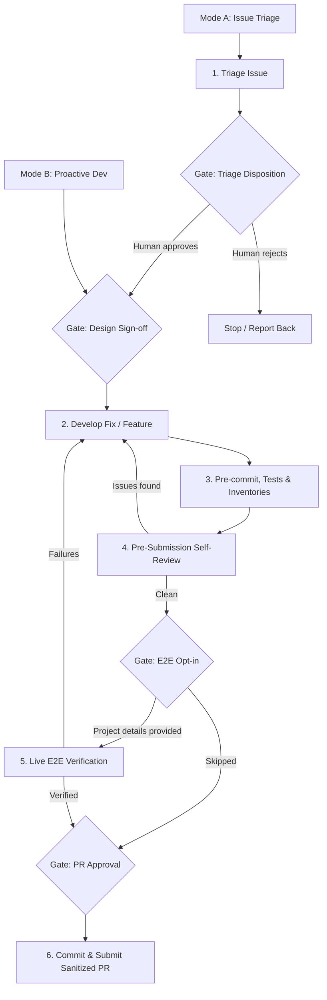

# GenAI Factory Contribution Flow Skill

This skill defines the end-to-end workflow for contributing to GenAI Factory. It supports two entry modes:
- **Mode A: Issue Triage & Bug Fix**: You are addressing an assigned or reported GitHub Issue. Start at **Step 1**.
- **Mode B: Proactive Development & PR Prep**: You are actively building a feature, adding a factory, or preparing an existing branch for a Pull Request. Jump directly to the **Design Sign-off Gate** before Step 2.

If it is unclear which mode applies, ask the user before proceeding.

## Human-in-the-Loop Gates

Gate on steps that are hard to reverse, costly, or where your judgment is likely to diverge from a maintainer's. Keep mechanical, reversible steps (linting, tests, doc and inventory regeneration) autonomous. Gates are **blocking**: if you are running non-interactively and cannot get an answer, stop — never assume approval.

| Gate | When | What the human decides |
| :--- | :--- | :--- |
| **Triage Disposition** | End of Step 1 (Mode A) | Whether the issue is in scope and worth pursuing: proceed, reject, or escalate. |
| **Design Sign-off** | Before Step 2 | Approves the proposed design and scope. Mandatory for new factories, new applications, and variable interface changes; skippable for trivial fixes where the design is self-evident. |
| **E2E Opt-in** | Step 5 | Whether to run live cloud verification. Providing a billing account, parent folder/organization, and prefix **is** the consent to deploy with them. |
| **Application Verification Opt-in** | Step 5, after the platform apply | Whether to also deploy and query the sample applications, given the described extra time and cost. |
| **PR Approval** | Step 6 | Reviews the final sanitized PR body before submission. |

---

## Step-by-Step Workflow



### Step 1: Triage the Issue (Mode A Only)

1.  **Retrieve Issue Details**: Use the GitHub CLI to view the issue context.
    ```bash
    gh issue view <issue-number>
    ```

2.  **Explore the Codebase**: Identify the target factory (e.g. `cloud-run-single/`) and the stage within it (`0-prereqs` or `1-apps`), or establish that the change belongs to a new factory, to the shared tooling in [tools/](../../tools), or to the test harness in [tests/](../../tests).

3.  **Evaluate Fit & Scope**: Assess whether the issue is relevant for GenAI Factory. Factories are **end-to-end blueprints for generative AI infrastructure on GCP**, built on Terraform resources and [Cloud Foundation Fabric](https://github.com/GoogleCloudPlatform/cloud-foundation-fabric) modules, following security best practices and the least-privilege principle. Confirm the change is a generic, reusable addition rather than a one-off customization, and that it belongs in an existing factory instead of warranting a new one (or vice versa). This repository focuses on AI *infrastructure*: application code under `1-apps/apps/` exists to exercise the infrastructure end to end, not to grow into a full application.

4.  **Read the Upstream Documentation**: If the issue involves Google Cloud resources, retrieve and read the documentation for the involved GCP resources, the Terraform provider resource/datasource, and the Fabric module being used, to ensure accurate implementation of attributes, behaviors, and constraints.
    *   Start from the provider registry, e.g. <https://registry.terraform.io/providers/hashicorp/google/latest/docs/resources/cloud_run_v2_service>.
    *   For Fabric modules, read the module README at the **pinned tag**, not `master`. All factories pin the same Fabric ref; check it with:
        ```bash
        grep -rho "ref=v[0-9.]*" --include="*.tf" . | sort -u
        ```
    *   Only rely on documentation for functionality available in a **released** provider or Fabric version: docs from a `main`/`master` branch may describe attributes that no released version accepts at plan time.
    > [!WARNING]
    > Do NOT rely solely on the proposed solution, examples, or partial specifications provided in the issue description. Always retrieve and review the complete documentation schema from the official provider registry or the Fabric module README.
    >
    > **Workaround for Registry Page JS/Redirection Errors**:
    > If the registry page fails to load properly with your URL-fetching tool (e.g. returns "Please enable Javascript" or truncates due to HTML formatting issues), find the source markdown file on GitHub and fetch its raw content with `curl` into a temporary file outside the repository (e.g. under `/tmp`, since this repository has no gitignored scratch directory), using the tag of the provider release whose docs you need (e.g. `v7.40.0`):
    > ```bash
    > curl -s https://raw.githubusercontent.com/hashicorp/terraform-provider-google/v7.40.0/website/docs/r/cloud_run_v2_service.html.markdown -o /tmp/cloud_run_v2_service_doc.md
    > ```
    > You can then search and view it locally to identify all supported arguments and blocks.
    > Use this information to make an informed decision on which arguments to support. 100% coverage is rarely desirable: expose what the factory's use case needs, deliberately rather than by omission.

5.  **Gate — Triage Disposition**: Present your assessment (target factory/stage, fit with the repository's scope, scope evaluation) and let the human decide whether to proceed. If the issue fails the fit test, report your reasoning and stop — do NOT comment on, label, or close the issue yourself; disposition of the issue is a maintainer decision.

### Gate: Design Sign-off (Modes A & B)

Before writing code, present the proposed design for approval:
*   The target factory(ies) and stage(s), and the shape of the variable interface (new/changed variables in `variables.tf`, changes to the YAML project definitions under `0-prereqs/data/projects/`).
*   Which values cross the stage boundary, i.e. whether `0-prereqs/outputs.tf` or `0-prereqs/templates/terraform.auto.tfvars.tpl` must change so `1-apps` receives them.
*   For provider-surface changes: the explicit list of provider/module arguments you intend to include and exclude, with reasoning.
*   Whether the change requires bumping the pinned Fabric ref (a repo-wide change — see Step 2.5).

This gate is **mandatory for new factories, new sample applications, and interface changes**. For trivial fixes (typos, one-line bugfixes with an obvious solution) where the design is self-evident, state your intent and proceed without blocking.

### Step 2: Develop the Fix or Feature (Modes A & B)

1.  **Align with the Repository Conventions**:
    > [!IMPORTANT]
    > You MUST strictly follow the structure, design principles, and coding conventions defined in [GEMINI.md](../../GEMINI.md) and [CONTRIBUTING.md](../../CONTRIBUTING.md) when designing variables, stages, and factories.

2.  **Set Up the Git Branch**: The default branch is `master`.
    *   If you are not already on a feature branch, create one: `feat/<name-of-feature>` for features, `bug/<name-of-bug>` for bugs.
        ```bash
        git checkout master && git pull
        git checkout -b feat/<name-of-feature>
        ```
    *   If preparing an existing branch (Mode B), do NOT create a new one; instead make sure it is up to date with `master` (rebase or merge) before submission.
    *   Direct branches require push access to the repository. Without it, fork the repository and open the PR from your fork, as described in [CONTRIBUTING.md](../../CONTRIBUTING.md); the rest of this workflow is identical.

3.  **Respect the Two-Stage Factory Contract**: Every factory is split into `0-prereqs` (run by the infrastructure team) and `1-apps` (run by the application team).
    *   **`0-prereqs`** creates the project(s) from the YAML files in `data/projects/`, the service accounts (the one impersonated to run `1-apps`, plus any runtime service accounts), the GCS state bucket, the enabled APIs, and the IAM grants. It renders `1-apps/providers.tf` and `1-apps/terraform.auto.tfvars` from `templates/`. Keep the stage's structure identical across factories: only the templates under `data/projects`, and occasionally `templates/terraform.auto.tfvars.tpl` and `outputs.tf`, differ.
    *   **`1-apps`** deploys the platform resources and prints, as Terraform outputs, the `gcloud`/`curl` commands that deploy and exercise the sample applications. Application deployment must stay outside Terraform.
    *   The YAML project definitions must remain usable standalone, by users running their own [FAST project factory](https://github.com/GoogleCloudPlatform/cloud-foundation-fabric/tree/master/fast/stages/2-project-factory) or a custom project creation process.
    *   `1-apps` variables that FAST stages export belong in `variables-fast.tf`, following the existing factories.

4.  **Apply the Terraform Design Conventions**:
    *   **Compact Variables**: Prefer object variables (e.g. `iam = { ... }`) over many scalars, and lean on `optional()` with defaults to keep the interface small.
    *   **Stable State Keys**: Always use maps instead of lists for collections, to avoid index shifts in Terraform state and `for_each` dynamic value errors.
    *   **Naming**: Never use random strings for resource names. Use the `name` variable consistently, plus the optional `prefix` variable for globally unique resources.
    *   **File Structure**: Use `main.tf`, `variables.tf`, `outputs.tf`; split a large `main.tf` by topic (`iam.tf`, `gcs.tf`, `lb-ext.tf`, ...).
    *   **Locals Separation**: Module-level locals for values referenced by resources and outputs; private locals prefixed with `_` for intermediate transformations. Move complex `for`/`for_each` transformations into locals so resource blocks stay clean.
    *   **Style**: 79-character line limit (relaxed for long attribute values and descriptions); wrap complex ternaries in parentheses with `?` and `:` aligned; split many-argument function calls across lines.
    *   **Validate ENUM Variables**: When a variable mirrors an ENUM in the underlying provider or module, add a `validation` block so bad values fail at plan time:
        ```hcl
        variable "storage_class" {
          description = "Bucket storage class."
          type        = string
          default     = "STANDARD"
          validation {
            condition     = contains(["STANDARD", "NEARLINE", "COLDLINE", "ARCHIVE"], var.storage_class)
            error_message = "Storage class must be one of STANDARD, NEARLINE, COLDLINE, ARCHIVE."
          }
        }
        ```

5.  **Keep Fabric References Consistent**: All factories pin the same Cloud Foundation Fabric tag. Never bump the ref in a single stage: update it everywhere at once, and update the compatibility statement in the [main README.md](../../README.md).
    ```bash
    uv run tools/fetch_latest_tag.py https://github.com/GoogleCloudPlatform/cloud-foundation-fabric
    uv run tools/update_fabric_ref.py . <tag>
    ```
    A nightly GitHub workflow ([tests-integration.yml](../../.github/workflows/tests-integration.yml)) already does this and opens a PR when tests pass, so a manual bump is only warranted when your change depends on a newer Fabric module.

6.  **Reference Implementations**:
    *   [cloud-run-single](../../cloud-run-single/README.md): the canonical factory, and the one to copy when scaffolding a new one.
    *   [cloud-run-rag-cloudsql](../../cloud-run-rag-cloudsql/README.md): a multi-service factory with data stores and a richer `1-apps` stage.
    *   [agent-runtime](../../agent-runtime/README.md): private VPC access, SWP egress, and ADK/A2A sample applications.

7.  **When Adding a New Factory**, follow the scaffolding rules in [GEMINI.md](../../GEMINI.md) and [CONTRIBUTING.md](../../CONTRIBUTING.md):
    *   Name the folder after the use case, the main product, or both (e.g. `cloud-run-nl2sql-bq`).
    *   Create exactly the two stage folders, `0-prereqs` and `1-apps`.
    *   Add `diagram.png` in `1-apps` and link it from its `README.md` (diagrams are drawn in the shared Google Slides deck referenced in [CONTRIBUTING.md](../../CONTRIBUTING.md)).
    *   Write three `README.md` files (factory root, `0-prereqs`, `1-apps`) mirroring the structure of the existing factories.
    *   Add the factory to the list in the [main README.md](../../README.md).

8.  **Add or Update Tests**:
    *   The test folder name mirrors the factory name with dashes replaced by underscores (`cloud-run-single` → `tests/cloud_run_single`), with a subfolder per stage: `0_prereqs` and `1_apps`.
    *   Each stage folder needs a `tftest.yaml` declaring the tests (the primary one is `simple`), plus a `<test-name>.tfvars` input and a `<test-name>.yaml` inventory per test.
    *   Test tfvars are the one exception to the gitignore rule on `*.tfvars` (`!tests/**/*.tfvars`), so they must contain placeholder values only.
    > [!NOTE]
    > Factory and stage directories use dashes (`cloud-run-single/0-prereqs`) while test directories use underscores (`tests/cloud_run_single/0_prereqs`). A mistyped path makes `pytest` silently collect zero tests.

### Step 3: Run Pre-commit, Tests & Inventory Regeneration (Modes A & B)

Install dependencies once with `uv sync --all-groups`, then run everything through `uv run`.

1.  **Run All Checks**: The pre-commit hook covers copyright boilerplate, `terraform fmt`, tflint, yamllint, codespell, yapf, documentation tables, and link validity — the same checks as the [linting workflow](../../.github/workflows/linting.yml).
    ```bash
    uv run pre-commit run --all-files
    ```
    Common fixes:
    ```bash
    terraform fmt -recursive .
    uv run yapf . --parallel --recursive --in-place --exclude '*/.venv/*'
    uv run yamlfix . --exclude "**/templates/**" --exclude "**/.terraform/**" --exclude "**/.venv/**"
    uv run codespell . --write-changes
    ```
    > [!NOTE]
    > **Common gotcha — unsorted variables (`[SV]` error):** `check_documentation.py` requires the variables in `variables.tf` to be in strict alphabetical order. When adding a variable, insert it at its alphabetical position, not at the top of the file.

2.  **Update Documentation**: If you changed variables or outputs, regenerate the README tables — never edit them by hand:
    ```bash
    uv run tools/tfdoc.py --replace cloud-run-single/0-prereqs
    uv run tools/check_documentation.py . --show-diffs --no-show-summary
    ```

3.  **Run Impacted Tests**: Run `pytest` on the factory you changed, then the full suite before submission.
    ```bash
    # Note the underscores in the test directory name
    uv run pytest tests/cloud_run_single
    uv run pytest -n4 tests
    ```

4.  **Regenerate Test Inventories**: When a plan legitimately changes, regenerate the expected inventory from the test tfvars:
    ```bash
    uv run tools/plan_summary.py cloud-run-single/0-prereqs \
      tests/cloud_run_single/0_prereqs/simple.tfvars \
      > tests/cloud_run_single/0_prereqs/simple.yaml
    ```
    > [!CAUTION]
    > Regenerating overwrites the assertion baseline, so the test then passes **by construction**. After regenerating, diff the inventory against the previous version (`git diff tests/`), verify that every changed line maps to the intended feature or fix, and report the inventory diff to the user. If a changed line is not explained by your change, treat it as a bug in your code, not a baseline to save.

### Step 4: Pre-Submission Self-Review (Modes A & B)

Review your own diff (`git diff HEAD`, or `git diff master...HEAD` for an existing branch) against the repository guidelines ([GEMINI.md](../../GEMINI.md), [CONTRIBUTING.md](../../CONTRIBUTING.md)) before submission. This is a pre-flight self-check; the canonical automated checks run in CI after the PR is opened.

Check the diff against this checklist:

*   [ ] Naming conventions respected (variables, outputs, resources); no random strings in names; `name`/`prefix` used consistently.
*   [ ] Variables and outputs in strict alphabetical order; 79-character lines; complex transformations moved to locals.
*   [ ] The two-stage contract holds: anything `1-apps` needs is produced by `0-prereqs` outputs and templates, and the `data/projects` YAML files stay usable standalone.
*   [ ] Fabric refs unchanged, or bumped everywhere at once together with the compatibility statement in the main README.
*   [ ] **CRITICAL TESTING RULE**: if resource blocks were modified (adding a new argument or modifying an existing one), the Terraform plan output changes — the corresponding inventory YAML files under `tests/` MUST be updated in the diff. If they are not, this is a critical testing failure.
*   [ ] New factory: both stages present, `diagram.png` added and linked, three READMEs written, tests added, factory listed in the main README.
*   [ ] Documentation tables regenerated with `tfdoc.py`; copyright headers present in new `.tf`, `.py`, `.sh`, `.yaml` files; all relative links resolve.
*   [ ] No state files, real tfvars, credentials, or local artifacts staged (`git status`), and no leftover `.terraform/` directories.

Report the outcome as a short plain-text list of issues found (or "no issues found") under a `Pre-submission self-review` heading — no emojis, no status tables. Fix any issue and loop back to Step 3 until the checklist passes.

### Step 5: Live Verification — E2E Deployment (Modes A & B — Optional / Recommended)

Plan-time tests do not prove a factory applies. When the change affects GCP resource structures or APIs, deploy it end to end. Run it only once the diff is stable (tests and self-review pass) to avoid repeated cloud deployments.

1.  **Gate — E2E Opt-in**: Ask the user for the values the factory needs — billing account, parent folder or organization ID, prefix, region — stating explicitly that providing them authorizes you to create and destroy projects and resources with `-auto-approve`. If they are not provided, skip this step entirely.

2.  **Verify Credentials**: Confirm `gcloud` authentication and Application Default Credentials are available (`gcloud auth list`, `gcloud auth application-default print-access-token`) before attempting any deployment, and surface a clear error rather than failing mid-apply.

3.  **Deploy `0-prereqs`**: Work inside the factory folder; `*.tfvars` and `*.tfstate` are gitignored there, so nothing leaks into the diff.
    ```bash
    cd <factory>/0-prereqs
    cp terraform.tfvars.sample terraform.tfvars   # fill in prefix, billing account, parent
    terraform init && terraform apply -auto-approve
    ```
    Confirm it rendered `../1-apps/providers.tf` and `../1-apps/terraform.auto.tfvars`.

4.  **Deploy `1-apps`**:
    ```bash
    cd ../1-apps
    cp terraform.tfvars.sample terraform.tfvars   # customize
    terraform init && terraform apply -auto-approve
    ```
    A clean apply is the baseline, not the goal: it only proves the API accepted the request.

5.  **Read-Back Verification (required)**: For every field or block touched by the change, verify the deployed state through the service's read API (`gcloud run services describe`, `gcloud projects get-iam-policy`, and equivalents) rather than through Terraform state or plan output. Confirm the live resource holds the intended value and structure, with nothing silently dropped.

6.  **Application Verification (optional — Gate)**:
    *   **Gate — Application Verification Opt-in**: after read-back verification passes, ask the user whether to also run the application deployment commands printed by the `1-apps` outputs, describing what it entails for this change (resources involved, expected extra time such as image builds and propagation delays, any additional cost). Proceed only on explicit approval; skipping is a valid outcome and must be recorded in the PR body.
    *   Run the `gcloud`/`curl` commands from the Terraform outputs exactly as a user would, then query the deployed application (for example, `curl` the Cloud Run endpoint or the load balancer, or send a prompt to the agent) and verify the response.
    *   Account for propagation delays (load balancers, certificates, IAM can take several minutes); retry before concluding failure.

7.  **Destroy Resources**:
    ```bash
    cd ../1-apps && terraform destroy -auto-approve
    cd ../0-prereqs && terraform destroy -auto-approve
    ```
    Destroy in reverse order, then remove the local `terraform.tfvars`, state files, `.terraform/` directories, and the generated `1-apps/providers.tf` and `1-apps/terraform.auto.tfvars` if they are not tracked. If verification surfaced failures, fix the code and loop back to Step 3 before re-deploying.

### Step 6: Commit & Submit the PR (Modes A & B)

1.  **Sanitize Before Committing**: PII sanitization applies to **everything that leaves your machine** — commits, file contents, and the PR body. Never commit real GCP project IDs, numeric project numbers, billing account IDs, organization or folder IDs, personal email addresses, or custom resource names from live testing. Verify `git status` shows no stray state, tfvars, or `.terraform/` files before staging.

2.  **Commit and Push**: Create atomic commits with clear, short, imperative messages, make sure the branch is up to date with `master` (rebase if needed), and push:
    ```bash
    git add <files>
    git commit -m "Add <feature> to the cloud-run-single factory"
    git push -u origin feat/<name-of-feature>
    ```

3.  **Format the PR Title**: Do NOT use Conventional Commits format (no `feat:` or `fix:` prefixes). Use a short, capitalized, imperative title, matching the repository history (e.g. "New Gemini Enterprise Agent Platform factory", "Bound the Fabric compatibility range at v58.0.0").

4.  **Write the PR Body**:
    *   Explain the problem, rationale, and the fix clearly.
    *   **Document Verification & E2E Testing Methodology**: Detail the local checks you ran (`pre-commit`, `pytest`) and, for E2E runs, the apply, read-back, and application verification results (or note that application verification was skipped) so reviewers can see the exact testing rationale and methodology.
    *   **CRITICAL PII SANITIZATION**: Before writing the PR description, **MUST scrub all developer PII** (real GCP project IDs, numeric project numbers, billing account IDs, organization/folder IDs, personal email addresses, usernames, and custom bucket/resource names) and replace them with generic placeholders (e.g. `my-project`, `123456789012`, `user:tester@example.com`, `test-bucket`).
    *   **Breaking Changes**: If the change requires users to update their `terraform.tfvars`, their `data/projects` YAML files, or their state (renamed or removed variables, changed resource addresses), call it out under a `**Breaking Changes**` heading with the concrete upgrade steps. Release notes are written by hand at release time from the merged PRs, so this section is what a maintainer will quote.

5.  **Gate — PR Approval**: Present the final sanitized PR title and body to the user and get explicit approval before creating the PR.

6.  **Create the PR**:
    *   **CRITICAL PITFALL**: Do NOT pass the body inline on the CLI if it contains backticks (e.g. ``gh pr create --body "Fixes `bug`"``), as the shell will evaluate them and corrupt the description. Do NOT use shell redirection or heredocs to create the body file either.
    *   Instead, write the body to a temporary file **using your file-writing tool**, then reference it:
        ```bash
        gh pr create --base master --title "Your PR Title" --body-file /tmp/pr-body.md
        ```
